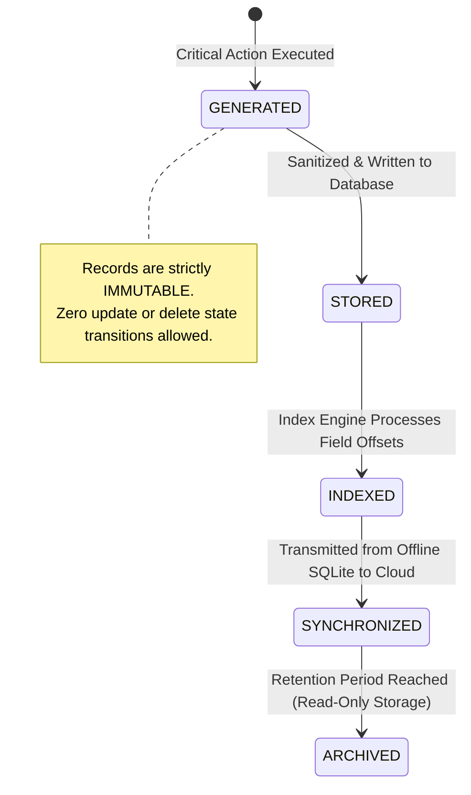

# Audit Logs User Flow & System Flow Specification — ClinicOS

## 1. Flow Architecture & Overview

The **Audit Logs Module (Module-013)** enforces a non-blocking, zero-data-loss user and system workflow architecture. Every state-modifying action or security event executed within **ClinicOS** triggers an automatic audit logging pipeline that records actor identity, target entity, timestamp, state diff summary, and device context.

Audit workflows guarantee **immutability**, **tenant isolation**, **zero PII leakage**, and **offline persistence**.

---

## 2. Core Execution Workflows

### 2.1 Audit Event Generation Flow
```
User Action (e.g. Create/Update Entity)
  │
  ▼
Permission & RBAC Validation (Pass/Fail)
  │
  ▼
Business Operation Executed in Database
  │
  ▼
Audit Event Interceptor Triggered
  │
  ▼
Sanitize Data (Strip passwords, secrets, PII)
  │
  ▼
Generate Audit Log Record (UUID, Timestamp, Diff)
  │
  ▼
Store in Audit Store (MongoDB / Local SQLite)
  │
  ▼
Dispatch Critical Security Alert (If Severity == CRITICAL)
```

---

### 2.2 Authentication Audit Flow
```
User Initiates Login / Password Action
  │
  ▼
Evaluate Credentials & JWT Signature
  ├─► SUCCESS ──► Emit AUTH_LOGIN_SUCCESS (Info) ──► Store Audit Record
  └─► FAILURE ──► Increment Failed Attempts
                     │
                     ├─► Count < Threshold ──► Emit AUTH_LOGIN_FAILED (Warning)
                     └─► Count >= Threshold ──► Lock Account ──► Emit AUTH_ACCOUNT_LOCKED (Critical)
```

---

### 2.3 Patient Audit Flow
*(Strict Requirement: Zero medical diagnosis or condition data stored in log entries; metadata only)*
```
Staff Creates / Updates / Archives Patient
  │
  ▼
Validate Patient Input Data
  │
  ▼
Persist Patient Profile in Database
  │
  ▼
Extract Non-Sensitive Metadata (Patient ID, Action, Changed Fields)
  │
  ▼
Emit PATIENT_CREATED / UPDATED / ARCHIVED Audit Event
  │
  ▼
Persist Immutable Audit Entry
```

---

### 2.4 Appointment Audit Flow
```
User Schedules / Updates / Cancels / Checks-In Appointment
  │
  ▼
Validate Appointment Schedule Rules
  │
  ▼
Persist Appointment State Change
  │
  ▼
Emit APPOINTMENT_CREATED / CANCELLED / CHECKED_IN Event
  │
  ▼
Store Audit Record (Actor ID, Patient ID, Doctor ID, Time Slot)
```

---

### 2.5 Financial Operations Audit Flow
```
User Enters Expense or Disburses Doctor Settlement
  │
  ▼
Verify Financial Authorization & Accounting Rules
  │
  ▼
Execute Transaction (Mark PAID / Create Settlement)
  │
  ▼
Emit EXPENSE_PAID / DOCTOR_SETTLEMENT_PAID Event (Severity: WARNING/CRITICAL)
  │
  ▼
Persist Audit Entry (Amount, Category, Actor ID, Account Code)
```

---

### 2.6 Backup & Restore Audit Flow
```
Backup or Disaster Recovery Restore Initiated
  │
  ▼
Emit BACKUP_STARTED / RESTORE_STARTED Audit Event
  │
  ▼
Execute System Operation
  ├─► SUCCESS ──► Emit BACKUP_COMPLETED / RESTORE_COMPLETED (Critical)
  └─► FAILURE ──► Emit BACKUP_FAILED / RESTORE_FAILED (Critical Alert)
```

---

### 2.7 Synchronization Audit Flow (Offline-to-Cloud)
```
Desktop Client Operates Offline
  │
  ▼
Local Actions Written to SQLite local_audit_logs with HMAC Digest
  │
  ▼
Network Reconnection Detected
  │
  ▼
Emit SYNC_STARTED Event
  │
  ▼
Transmit Local Audit Queue to Backend
  │
  ▼
Validate HMAC Digests & Deduplicate Request IDs
  │
  ▼
Emit SYNC_COMPLETED (Preserving Original Execution Timestamps)
```

---

### 2.8 Audit Viewer Workflow
```
Clinic Manager / Owner Opens Audit Logs Interface
  │
  ▼
Verify RBAC Scoping (Ensure Non-SUPER_ADMIN for Clinic Logs)
  │
  ▼
Load Paginated Audit Roster
  │
  ▼
User Appears Controls: [Search Bar] [Date Range Picker] [Module Filter] [Severity Filter]
  │
  ▼
User Selects Record ──► Open Audit Details Drawer / Modal Inspector
  │
  ▼
Optional: User Clicks "Export Audit Log" ──► Download Signed PDF/CSV
```

---

### 2.9 Search & Multi-Filter Workflow
```
User Submits Search Query / Date Range / Module Filter
  │
  ▼
Validate Query Parameters (Page >= 1, Limit <= 100, Valid Dates)
  │
  ▼
Execute Covered Index Query in Audit Store
  │
  ▼
Return Bounded Audit Roster with Pagination Metadata
  │
  ▼
Render Audit Table with Color-Coded Severity Badges
```

---

### 2.10 Future External Security & SIEM Integration Flow (V2 Architecture)
```
Audit Event Emitted in System
  │
  ▼
Async Event Bus (Kafka / NATS)
  │
  ▼
Security Pipeline Filter
  │
  ▼
Format Conversion (Syslog / CEF Protocol)
  │
  ▼
Transmit to External SIEM (Splunk / Datadog / Sentinel)
```

---

## 3. Audit Record Lifecycle State Machine



---

## 4. Severity Escalation & Acknowledgment Workflow

```
[INFORMATION]  ──► Routine System Operations (Logins, Check-ins, Visit Notes)
[WARNING]      ──► Suspicious / Sensitivity Actions (Failed Logins, Record Prints, Cancellations)
[ERROR]        ──► Operation Failures (Sync Errors, Export Failures)
[CRITICAL]     ──► High Security Risk (Account Lockouts, Role Changes, Restores, Backup Failures)
                      │
                      ▼
               Requires Formal Manager Acknowledgment in Dashboard
```

---

## 5. RBAC Workflow Matrix

| User Role | Navigation Target | Permitted Views & Actions | Blocked Actions |
| --- | --- | --- | --- |
| `SUPER_ADMIN` | `/admin/audit-logs` | View global platform system logs (`tenantId: PLATFORM`). | Blocked from viewing clinic operational or patient logs (`403 Forbidden`). |
| `ClinicOwner` | `/dashboard/audit-logs` | Full read-only access to clinic audit roster, search, filter, export. | Edits, deletions, or modifying retention settings. |
| `ClinicAdmin` | `/dashboard/audit-logs` | Full read-only access to clinic audit roster, search, filter, export. | Edits or deletions. |
| `Doctor` | `/dashboard/profile/security-log` | View self account security history (logins, password changes). | Viewing other staff/doctor audit trails. |
| `Receptionist` | N/A | None. | Access Denied (`403 Forbidden`). |

---

## 6. Exception Flow Catalog

| Exception Code | Failure Scenario | Trigger Cause | System Recovery Workflow |
| --- | --- | --- | --- |
| `EF-001` | Permission Denied | Unauthorized role (e.g. Receptionist) accesses audit route | Render 403 Forbidden error screen with security alert. |
| `EF-002` | Audit Write Failure | Database write failure during business action | Enqueue audit record in local async fallback queue; do not fail business transaction. |
| `EF-003` | Offline Sync Failure | Network drop during audit queue upload | Retry upload with exponential backoff upon reconnection. |
| `EF-004` | HMAC Digest Mismatch | Local SQLite log file tampered with offline | Flag tampered records with `CRITICAL` alert `AUDIT_TAMPERING_DETECTED`. |
| `EF-005` | Invalid Filter Parameters | User specifies invalid date range (`startDate > endDate`) | Display inline validation error message on filter toolbar. |
| `EF-006` | Export Failure | PDF/CSV generation timeout | Display toast notification and retry export job asynchronously. |
| `EF-007` | Cross-Tenant Audit Access | User attempts to inspect log from another clinic tenant | Block request immediately; emit `SECURITY_ISOLATION_VIOLATION` event. |
| `EF-008` | Database Connection Timeout | Audit store unreachable | Buffer events in memory circular queue until DB connection restored. |
| `EF-009` | Secret Extraction Barrier Failure | Action context payload contains password string | Interceptor regex strips secret fields automatically before storage. |

---

## 7. Dashboard Integration Workflow

1. **Security Alert Banner**: Displays active unacknowledged `CRITICAL` audit events (e.g., account lockouts, backup failures) to Clinic Managers.
2. **Recent Security Events Widget**: Summarizes recent high-severity audit events on the executive dashboard without exposing unauthorized patient PII.
3. **Role-Based Filtering**: Dashboard widgets automatically filter out prohibited audit entries according to the active user's authorization role.
