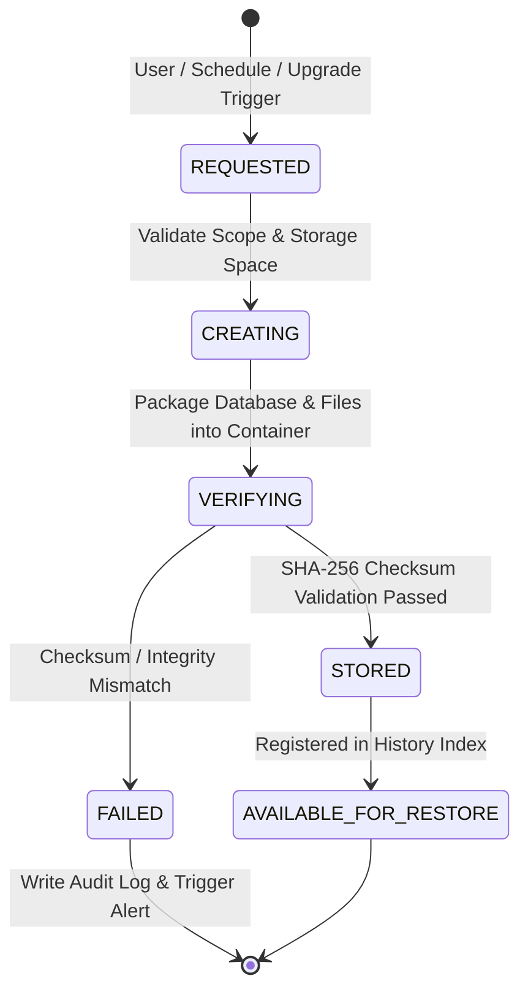
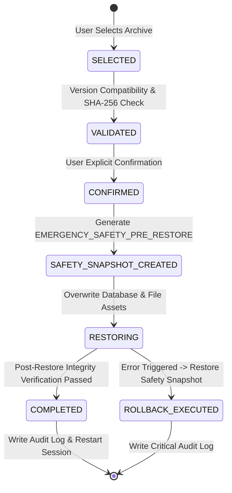

# Backup & Restore User Flow & Workflow Architecture Specification — ClinicOS

## 1. Executive Summary & Workflow Design Principles

The **Backup & Restore Module (Module-014)** provides disaster recovery, data protection, and resilience workflows for **ClinicOS**. Designed primarily for an **Offline-First Desktop Architecture**, the workflow engine guarantees that backup creation never interrupts active clinic operations, invalid or corrupted backup files are rejected prior to execution, and every restore operation is guarded by a mandatory pre-restore safety snapshot (`EMERGENCY_SAFETY_PRE_RESTORE`) with automatic rollback on failure.

### Core Workflow Principles
1. **Non-Blocking Background Backup Engine**: Automatic scheduled backups execute asynchronously in background worker threads without locking the primary user interface.
2. **Mandatory Safety Pre-Restore Snapshot**: The system creates an emergency safety backup archive before restoring any selected data set, ensuring automatic rollback capabilities.
3. **Cryptographic Anti-Tamper Verification**: SHA-256 manifest checksum validation must pass 100% before a backup container is made available for restoration.
4. **Platform Owner Barrier (`PLATFORM_ADMIN_BACKUP_RESTRICTED`)**: Clinic operational data backups are strictly isolated from Platform System Infrastructure backups. Platform Owners (`SUPER_ADMIN`) cannot view or extract clinic backup contents.
5. **Zero Emojis & Complete Auditability**: Iconography strictly adheres to Lucide React SVG components. Every backup request, verification result, restore attempt, and deletion event automatically writes an immutable audit record.

---

## 2. Backup & Restore Lifecycle State Machines

### 2.1 Backup Archive Creation Lifecycle

### 2.2 System Restore Execution Lifecycle

---

## 3. Core Execution Workflows

### 3.1 FLOW-001: Manual On-Demand Backup Flow
1. **Trigger**: Clinic Manager clicks `Create Manual Backup` in the Backup Center.
2. **Permission Gate**: System verifies active JWT payload contains `ClinicOwner` or `ClinicAdmin` role.
3. **Scope Confirmation**: User inputs optional custom backup label.
4. **Storage Check**: System calculates required disk space against available local storage.
5. **Archive Packaging**: Database collections and file assets packaged into encrypted `.cbk` container via AES-256-GCM.
6. **Integrity Check**: SHA-256 manifest hashes generated and verified.
7. **Success Output**: UI renders green confirmation badge with file size and record count summary.

### 3.2 FLOW-002: Scheduled Automatic Background Backup Flow
1. **Trigger**: Background timer triggers according to clinic schedule (`Daily`, `Weekly`, `Monthly`, or `Every Login`).
2. **System Pre-Check**: Verifies system is not currently executing a restore or database migration.
3. **Silent Background Execution**: Backup container generated asynchronously. UI remains fully responsive.
4. **Retention Policy Enforcer**: Automatically purges oldest verified backups beyond active limit (e.g. 5, 10, or 20) while enforcing the **Protected Newest Backup Rule**.

### 3.3 FLOW-003: Mandatory Pre-Upgrade Backup Flow
1. **Trigger**: Application update or database schema migration initiated.
2. **Automatic Creation**: System creates an immutable pre-upgrade backup tagged `PRE_UPGRADE_vX.Y.Z`.
3. **Validation Check**: Upgrade proceeds ONLY if backup creation and checksum verification pass 100%.
4. **Abort Guard**: If backup fails, update halts immediately to prevent data loss.

### 3.4 FLOW-004: Emergency Pre-Operation Backup Flow
1. **Trigger**: User attempts high-risk administrative action (e.g., bulk patient archiving or database purge).
2. **Safety Prompt**: System presents warning dialog suggesting an emergency backup.
3. **Instant Execution**: Immediate snapshot generated before executing requested operation.

### 3.5 FLOW-005: Safe Disaster Restore Flow
1. **Trigger**: Clinic Manager selects a backup archive from history and clicks `Restore Backup`.
2. **Preview Mode**: UI renders backup metadata (Date, App Version, DB Version, File Size, Total Records).
3. **Version & Checksum Verification**: Cryptographic digest and schema compatibility validated.
4. **Confirmation Modal**: User explicitly types clinic name or confirmation phrase.
5. **Safety Snapshot**: System automatically creates `EMERGENCY_SAFETY_PRE_RESTORE` snapshot.
6. **Data Replacement**: Database tables and local files overwritten with backup archive contents.
7. **Post-Restore Audit & Notification**: Writes `SYSTEM_RESTORE_COMPLETED` audit log and prompts application restart.

### 3.6 FLOW-006: Cryptographic Checksum Verification Flow
1. **Trigger**: User clicks `Verify Integrity` or system prepares a restore operation.
2. **Hashing**: SHA-256 digest computed for container archive and internal database manifests.
3. **Comparison**: Computed hashes matched against signed manifest embedded during backup creation.
4. **Result**: Status updated to `VERIFIED` or `CORRUPTED`.

### 3.7 FLOW-007: Backup History & Inspector Flow
1. **Trigger**: Authorized user opens `/dashboard/backup/history`.
2. **Display**: Paginated table rendering Backup ID, Type, Creation Date, File Size, Retention Status, and Verification Badge.
3. **Multi-Filtering**: Filter by Backup Type (`MANUAL`, `AUTOMATIC`, `PRE_UPGRADE`, `EMERGENCY`) or Verification Status.

### 3.8 FLOW-008: Offline Backup & Post-Reconnect Sync Reconciliation Flow
1. **Offline Mode**: Backup created locally during internet outage.
2. **Sync Vector Retention**: Backup container preserves local HMAC sync sequence numbers.
3. **Reconnection**: When internet connectivity resumes, cloud sync engine compares local vs remote vectors without generating duplicate records or data conflicts.

---

## 4. RBAC & Security Permission Workflow Matrix

| Workflow Action | ClinicOwner / Manager | Doctor | Receptionist | SUPER_ADMIN (Platform) |
| --- | --- | --- | --- | --- |
| Execute Manual Backup | `ALLOWED` | `FORBIDDEN` | `FORBIDDEN` | `PLATFORM_ONLY` |
| Configure Automatic Schedule | `ALLOWED` | `FORBIDDEN` | `FORBIDDEN` | `PLATFORM_ONLY` |
| Inspect Backup History | `ALLOWED` | `FORBIDDEN` | `FORBIDDEN` | `PLATFORM_ONLY` |
| Execute System Restore | `ALLOWED` | `FORBIDDEN` | `FORBIDDEN` | `FORBIDDEN (Clinic Data)` |
| Delete Backup Archive | `ALLOWED` | `FORBIDDEN` | `FORBIDDEN` | `PLATFORM_ONLY` |

---

## 5. Exception Flow Catalog

| Exception ID | Trigger Cause | System Response / Workflow Recovery |
| --- | --- | --- |
| `EF-001` | Unauthorized user role attempts backup operation | Reject request, log `SECURITY_PRIVILEGE_VIOLATION` audit log, display `403 Forbidden` modal. |
| `EF-002` | Insufficient local storage disk space | Abort backup, display disk space alert with required vs available storage specs. |
| `EF-003` | Cryptographic checksum mismatch detected | Mark backup as `CORRUPTED`, block restore operation, prompt user to select another archive. |
| `EF-004` | Application schema version mismatch | Display version mismatch warning modal with migration instructions. |
| `EF-005` | Pre-restore safety snapshot fails | Halt restore process immediately before modifying active database state. |
| `EF-006` | Error during restore data replacement | Trigger automatic rollback to `EMERGENCY_SAFETY_PRE_RESTORE` snapshot. |
| `EF-007` | Backup decryption key / password incorrect | Reject restore attempt, prompt for correct passphrase (`401 DECRYPTION_FAILED`). |
| `EF-008` | Mandatory pre-upgrade backup fails | Stop system update / migration process, write error log. |
| `EF-009` | Local SQLite database file locked by another process | Retry operation 3 times before returning `409 STORAGE_LOCK_CONFLICT`. |

---

## 6. Dashboard Integration Security & Health Widgets

1. **Backup System Health Card**: Widget on executive dashboard displaying Last Backup Date, Status (Verified/Failed), Next Scheduled Backup Time, and Storage Consumption.
2. **Backup Failure Alert Banner**: Highlighted banner rendered on Clinic Manager dashboard if automatic scheduled backup fails or has not been performed in > 7 days.
