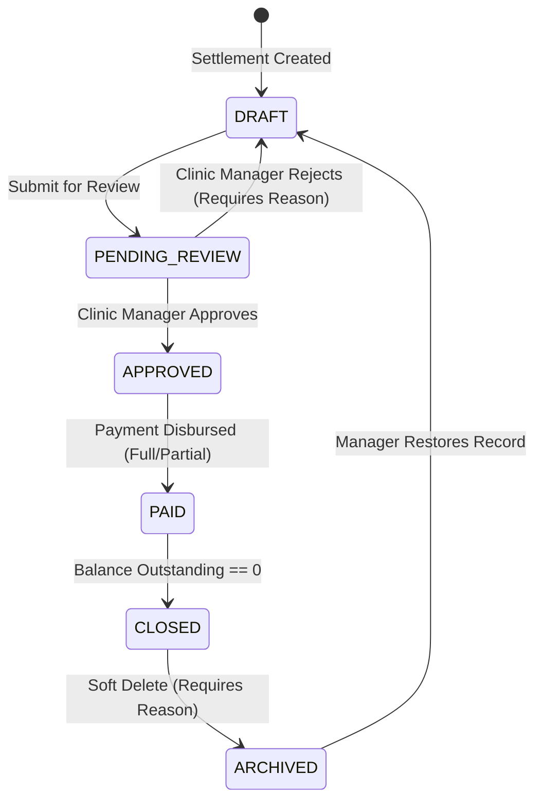

# Doctor Financial Accounts User Flows & System Workflows (DOCTOR_FINANCIAL_ACCOUNTS_FLOW.md)

This document specifies the complete user interaction flows, system execution workflows, state machine transitions, permission security enforcement, and exception handling for the **Doctor Financial Accounts Module** (Module-010) of ClinicOS.

---

## 1. Executive Overview & Workflow Principles

The Doctor Financial Accounts Module orchestrates the financial lifecycle between the clinic and doctors. Workflows are designed around four core principles:

1. **Automated Revenue Recognition**: Revenue and earnings are automatically calculated when an appointment transitions to `COMPLETED`.
2. **State-Driven Financial Control**: Settlements follow a linear state machine (`DRAFT` ➔ `PENDING_REVIEW` ➔ `APPROVED` ➔ `PAID` ➔ `CLOSED` ➔ `ARCHIVED`).
3. **Role-Based Financial Scoping**: Doctors access only their own earnings and statements; Clinic Managers possess full administrative control; Receptionists and Platform Owners are denied access (`403 Forbidden`).
4. **Audit Trail Governance**: Every state change, payment disbursement, or archival action emits an immutable audit event.

---

## 2. Core User & System Workflows

### Flow 1: Automated Appointment Revenue Generation
```
[Appointment Completed] ──> [Calculate Revenue] ──> [Apply Compensation Model] ──> [Update Doctor Balance]
```
- **Trigger**: Doctor marks appointment as `COMPLETED`.
- **System Actions**:
  1. Retrieves appointment gross consultation fee.
  2. Fetches doctor's active compensation settings (Percentage or Fixed Fee).
  3. Calculates `doctorShare` and `clinicShare`.
  4. Records line item in un-settled revenue ledger.
  5. Updates real-time doctor earnings dashboard counters.

### Flow 2: Settlement Creation Workflow
```
[Clinic Manager] ──> [Select Doctor & Date Range] ──> [System Aggregates Line Items] ──> [Create DRAFT Settlement]
```
- **Actor**: Clinic Manager.
- **System Actions**:
  1. Queries all `COMPLETED` un-settled visits for selected doctor within `startDate` and `endDate`.
  2. Aggregates `completedVisitsCount`, `grossRevenue`, `doctorShare`, and `clinicShare`.
  3. Generates unique settlement code (`STL-YYYYMM-XXXXX`).
  4. Saves record in `DRAFT` status.

### Flow 3: Settlement Review & Approval Workflow
```
[DRAFT Settlement] ──> [Submit for Review] ──> [Manager Review] ──> [APPROVE / REJECT]
```
- **Actor**: Clinic Manager.
- **System Actions**:
  - **Approval Path**: Transitions status to `APPROVED`. Locks line items against modification.
  - **Rejection Path**: Prompts manager for rejection reason notes. Transitions status back to `DRAFT` for correction.

### Flow 4: Full Payment Disbursement Workflow
```
[APPROVED Settlement] ──> [Disburse Full Payment] ──> [Record Payment Method & Date] ──> [Status: PAID / CLOSED]
```
- **Actor**: Clinic Manager.
- **System Actions**:
  1. Manager enters `amountPaid` equal to `doctorShare`, `paymentDate`, and `paymentMethod` (`CASH`, `BANK_TRANSFER`, etc.).
  2. System sets `outstandingBalance = 0`.
  3. Transitions status to `PAID` and automatically marks settlement as `CLOSED`.

### Flow 5: Partial Payment Workflow
```
[APPROVED Settlement] ──> [Record Partial Payment] ──> [Update Outstanding Balance] ──> [Status: PAID (Partial)]
```
- **Actor**: Clinic Manager.
- **System Actions**:
  1. Manager enters partial `amountPaid` (less than `doctorShare`).
  2. System calculates `outstandingBalance = doctorShare - cumulativeAmountPaid`.
  3. Status updates to `PAID`, but remains open for subsequent disbursements until `outstandingBalance == 0`.

### Flow 6: Doctor Self-Service Portal & Statement Export
```
[Doctor Login] ──> [Financial Dashboard] ──> [View Un-settled & Paid Accounts] ──> [Export Statement PDF]
```
- **Actor**: Doctor.
- **System Actions**:
  1. Authenticates doctor and restricts data query strictly to `doctorId == currentUserId`.
  2. Displays real-time KPIs (Earned Month-To-Date, Unsettled Balance, Last Payout).
  3. Generates downloadable PDF settlement statement.

### Flow 7: Roster Search & Multi-Criteria Filtering
- **Actor**: Clinic Manager / Doctor.
- **Filters**: Filter by doctor, status (`DRAFT`, `APPROVED`, `PAID`), payment method, date range, amount bounds.

### Flow 8: Financial Reporting & Dashboard Sync
- **System Actions**: Automatically recalculates clinic Net Profit & Loss (P&L = Gross Revenue - Paid Clinic Overhead - Paid Doctor Share).

### Flow 9: Real-Time Sync & Notification Engine
- **System Actions**: Triggers WebSocket and toast notifications to doctor upon settlement approval or payment disbursement.

### Flow 10: Soft-Delete Archival & Restoration
- **Actor**: Clinic Manager.
- **System Actions**: Marks `archived: true` with mandatory reason string. Soft-deleted records remain accessible via archive filter.

---

## 3. State Machine Diagram & Transition Rules



---

## 4. Role-Based Permission Matrix

| User Role | View Own Earnings | View All Doctors | Create Settlement | Approve & Disburse | Archive Settlement |
| --- | --- | --- | --- | --- | --- |
| **Doctor** | ALLOWED | DENIED | DENIED | DENIED | DENIED |
| **Clinic Manager** | ALLOWED | ALLOWED | ALLOWED | ALLOWED | ALLOWED |
| **Receptionist** | DENIED | DENIED | DENIED | DENIED | DENIED |
| **Platform Owner** | **FORBIDDEN (403)** | **FORBIDDEN (403)** | **FORBIDDEN (403)** | **FORBIDDEN (403)** | **FORBIDDEN (403)** |

---

## 5. Exception Flow Catalog (10 Failure Paths & Recovery)

1. **Platform Owner Barrier Violation**: Attempt by `PLATFORM_ADMIN` returns `403 Forbidden` (`PLATFORM_ADMIN_FINANCIAL_RESTRICTED`).
2. **Unauthorized Cross-Tenant Attempt**: Accessing foreign `tenantId` returns `404 Not Found`.
3. **Doctor Viewing Another Doctor's Account**: Doctor attempting to view another doctor's financial data returns `403 Forbidden` (`INSUFFICIENT_PERMISSIONS`).
4. **Duplicate Settlement Period Overlap**: Creating a settlement overlapping an existing active settlement period returns `409 Conflict` (`SETTLEMENT_PERIOD_OVERLAP`).
5. **Overpayment Violation**: Attempting to pay `amountPaid > doctorShare` returns `400 Bad Request` (`OVERPAYMENT_EXCEEDS_SHARE`).
6. **Immutable Settlement Modification**: Editing a `PAID` or `CLOSED` settlement returns `409 Conflict` (`SETTLEMENT_LOCKED`).
7. **Missing Rejection / Archive Reason**: Submitting blank reason string returns `400 Bad Request` (`MISSING_REASON_TEXT`).
8. **Concurrent Settlement Edit Conflict**: Optimistic locking failure returns `409 Conflict` (`CONCURRENT_MODIFICATION_CONFLICT`).
9. **Uncompleted Visit Selection**: Attempting to include non-`COMPLETED` visits returns `400 Bad Request` (`UNCOMPLETED_VISIT_EXCLUDED`).
10. **Database Connection Failure**: Returns `500 Internal Server Error` with transaction rollback.

---

## 6. Reserved Future Extension Slots (V2 Specification)

1. **Automated Payroll Workflow**: Direct integration into monthly payroll runs.
2. **Tax Withholding Engine**: Deduction of local income tax before disbursement.
3. **Bonuses & Penalty Adjustments**: Automated bonus additions and lateness/penalty deductions.
4. **Direct Electronic Funds Transfer (EFT)**: One-click payout via banking APIs.
5. **Accounting Journal Ledger Entries**: Automated posting of Debit/Credit accounting ledger transactions.
