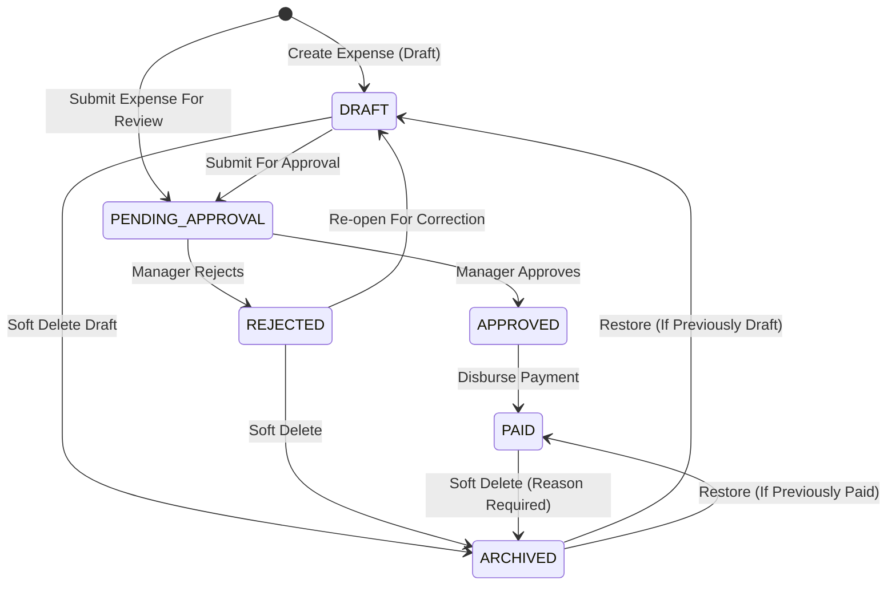

# Expenses Management Module User Flows & System Flows (EXPENSES_MANAGEMENT_FLOW.md)

This document establishes the official user interaction flows, system execution engines, state machine transitions, permission matrices, exception handling procedures, and dashboard integration workflows for the **Expenses Management Module** (Module-009) of ClinicOS.

---

## 1. Workflow Architecture & State Machine

Every operational expense document in ClinicOS follows a strict, audit-proof state machine lifecycle.



### State Machine Transition Rules & Immutability Matrix

| From Status | Allowed To Status | Required Action / Trigger | Actor Permissions | Financial Profit Impact |
| --- | --- | --- | --- | --- |
| `[NEW]` | `DRAFT` | Save Expense Draft | Staff, Reception, Doctor, Manager | None (0.00) |
| `[NEW]` | `PENDING_APPROVAL` | Submit Expense | Staff, Reception, Doctor, Manager | None (0.00) |
| `DRAFT` | `PENDING_APPROVAL` | Submit For Review | Creator, Staff, Manager | None (0.00) |
| `DRAFT` | `ARCHIVED` | Soft Delete Draft | Creator, Manager | None (0.00) |
| `PENDING_APPROVAL` | `APPROVED` | Approve Expense | Clinic Manager, Accountant | None (Pending Liability) |
| `PENDING_APPROVAL` | `REJECTED` | Reject (with notes) | Clinic Manager, Accountant | None (0.00) |
| `APPROVED` | `PAID` | Execute Payment | Clinic Manager, Accountant | **Recognized Expense (-Amount)** |
| `REJECTED` | `DRAFT` | Re-open For Edit | Creator, Staff, Manager | None (0.00) |
| `PAID` | `ARCHIVED` | Soft Delete (Reason) | Clinic Manager | Reverts Recognized Expense |
| `ARCHIVED` | `PAID` / `DRAFT` | Restore Record | Clinic Manager | Re-applies Financial Status |

---

## 2. Detailed User Interaction Flows

### Flow 1: Create Expense (Draft vs Submit For Approval)
- **Actor**: Staff, Receptionist, Doctor, or Clinic Manager.
- **Goal**: Record a new operating expenditure incurred by the clinic.

```
[User] Navigates to /dashboard/expenses
   ↓
[User] Clicks "+ Create Expense"
   ↓
[System] Renders Expense Creation Workspace Form
   ↓
[User] Selects Category (e.g. "Medical Supplies"), Enters Title, Amount, Currency, Expense Date, Payment Method, and Vendor
   ↓
[User] Choice:
   ├── Option A: Click "Save Draft"
   │     ↓
   │   [System] Validates inputs ➔ Saves record with status = "DRAFT" ➔ Assigns EXP-YYYYMM-XXXXX ➔ Redirects to Details
   │
   └── Option B: Click "Submit For Approval"
         ↓
       [System] Validates inputs ➔ Saves record with status = "PENDING_APPROVAL" ➔ Emits Manager Notification ➔ Redirects to Roster
```

---

### Flow 2: Expense Approval & Rejection Workflow
- **Actor**: Clinic Manager or Authorized Financial Accountant.
- **Goal**: Review pending staff expenses and approve or reject expenditures.

```
[Manager] Opens /dashboard/expenses?status=PENDING_APPROVAL
   ↓
[Manager] Selects Expense Item (e.g. EXP-202607-00104)
   ↓
[System] Displays Expense Review Modal with Title, Category, Amount, Vendor, and Creator Info
   ↓
[Manager] Decision:
   ├── Option A: Click "Approve Expense"
   │     ↓
   │   [System] Validates tenant ownership ➔ Updates status to "APPROVED" ➔ Logs approvedBy & approvedAt ➔ Updates Pending Liabilities counter
   │
   └── Option B: Click "Reject Expense"
         ↓
       [System] Prompts for mandatory Rejection Reason ➔ Updates status to "REJECTED" ➔ Notifies Creator ➔ Logs audit trail
```

---

### Flow 3: Payment Execution Workflow (`PAID` Status Transition)
- **Actor**: Clinic Manager or Authorized Financial Accountant.
- **Goal**: Disburse funds and confirm payment execution.

```
[Manager] Opens Approved Expense (status = "APPROVED")
   ↓
[Manager] Clicks "Mark as Paid"
   ↓
[System] Displays Payment Execution Dialog
   ↓
[Manager] Selects Payment Method (CASH, BANK_TRANSFER, CREDIT_CARD, CHEQUE, OTHER) and Enters Disbursement Date
   ↓
[Manager] Clicks "Confirm Payment"
   ↓
[System] Validates inputs:
   - Updates status to "PAID"
   - Sets paymentDate = Date
   - Logs paidBy & paidAt timestamps
   - **UPDATES REALIZED NET PROFIT KPI IN FINANCIAL DASHBOARD**
   - Locks core financial fields (amount, currency, date)
```

---

### Flow 4: Draft Editing Workflow
- **Actor**: Expense Creator, Staff, or Clinic Manager.
- **Goal**: Update details of an unapproved expense draft or rejected submission.

```
[User] Opens Expense (status = "DRAFT" or "REJECTED")
   ↓
[User] Clicks "Edit Expense"
   ↓
[System] Renders Editable Form (amount, category, vendor, description, notes)
   ↓
[User] Modifies fields and clicks "Save Changes" or "Resubmit"
   ↓
[System] Validates status == "DRAFT" or "REJECTED" ➔ Updates record ➔ Increments version ➔ Logs audit update
```

---

### Flow 5: Archival Soft-Delete Workflow
- **Actor**: Clinic Manager.
- **Goal**: Soft-delete a cancelled or erroneous expense record while preserving compliance auditability.

```
[Manager] Opens Expense Details View
   ↓
[Manager] Clicks "Archive Expense"
   ↓
[System] Prompts for Mandatory Archival Reason Text
   ↓
[Manager] Enters Reason (e.g. "Duplicate entry recorded in error") and Clicks "Confirm Archive"
   ↓
[System] Updates record:
   - Sets archived = true
   - Sets status = "ARCHIVED"
   - Logs archivedBy, archivedAt, and archivedReason
   - Removes item from active directory roster (retained in archived reports)
```

---

### Flow 6: Archival Restoration Workflow
- **Actor**: Clinic Manager.
- **Goal**: Restore a previously archived expense record back to active status.

```
[Manager] Opens /dashboard/expenses?status=ARCHIVED
   ↓
[Manager] Selects Archived Expense and Clicks "Restore Expense"
   ↓
[System] Validates archived == true ➔ Restores status to previous state ("FINALIZED"/"PAID"/"DRAFT") ➔ Resets archived = false ➔ Logs audit trail
```

---

### Flow 7: Multi-Criteria Directory Search & Filtering Workflow
- **Actor**: All Authorized Users.
- **Goal**: Search and locate specific expense documents across enterprise datasets.

```
[User] Opens Expenses Roster Directory
   ↓
[User] Interacts with Search Toolbar:
   - Enters text in Search Bar (Title, Vendor, Expense Number EXP-...)
   - Selects Category Filter (e.g. "Medical Supplies")
   - Selects Date Range (startDate to endDate)
   - Selects Status Filter (DRAFT, PENDING_APPROVAL, APPROVED, PAID)
   - Selects Payment Method (CASH, BANK_TRANSFER)
   ↓
[System] Debounces query input (300ms) ➔ Executes multi-criteria query against tenant index ➔ Renders paginated roster table
```

---

### Flow 8: Financial Reporting & Export Workflow
- **Actor**: Clinic Manager, Accountant.
- **Goal**: Generate monthly category expense breakdown and export P&L report data.

```
[User] Navigates to /dashboard/expenses/reports
   ↓
[User] Selects Fiscal Month / Year and Report Type (Category Breakdown, Vendor Summary, Monthly Trend)
   ↓
[System] Aggregates PAID expenses for selected period ➔ Computes Total Expenditures & Net Profit Impact ➔ Renders visual charts
   ↓
[User] Clicks "Export Report (CSV / PDF)"
   ↓
[System] Streams structured report file for download
```

---

### Flow 9: Financial Dashboard Real-Time KPI Sync Workflow
- **Actor**: System Execution Engine.
- **Goal**: Keep clinic financial KPIs accurate and in sync.

```
[Event] Expense State Changes to "PAID"
   ↓
[System Engine] Triggers Financial Sync Event:
   - Recalculates Total Recognized Expenditures for current month
   - Subtracts Paid Expense total from Gross Revenue
   - Updates Net Profit KPI metric on Financial Dashboard
   - Decrements Pending Liabilities counter
```

---

### Flow 10: Governance Audit Logging Engine Workflow
- **Actor**: System Engine.
- **Goal**: Capture immutable governance audit logs for every write mutation.

```
[Event] Any POST, PUT, or PATCH operation executed on expenses
   ↓
[System Engine] Captures Audit Context:
   - actorId, actorRole, tenantId, IP address, timestamp
   - actionType (EXPENSE_CREATED, EXPENSE_APPROVED, EXPENSE_PAID, EXPENSE_ARCHIVED)
   - previousState & newState snapshot
   ↓
[System Engine] Appends audit log to `expense_audit_logs` collection
```

---

## 3. Role-Based Permission Matrix

ClinicOS enforces strict Role-Based Access Control (RBAC) across all expense workflows:

| Workflow Operation | Doctor | Receptionist | Clinic Manager | Accountant (Future) | Platform Admin |
| --- | --- | --- | --- | --- | --- |
| **View Expense Directory** | Policy-Based | Policy-Based | Allowed | Allowed | **DENIED (403)** |
| **Create Expense Draft** | Allowed | Allowed | Allowed | Allowed | **DENIED (403)** |
| **Submit For Approval** | Allowed | Allowed | Allowed | Allowed | **DENIED (403)** |
| **Edit Draft Expense** | Creator Only | Creator Only | Allowed | Allowed | **DENIED (403)** |
| **Approve Expense** | Denied | Denied | Allowed | Allowed | **DENIED (403)** |
| **Reject Expense** | Denied | Denied | Allowed | Allowed | **DENIED (403)** |
| **Execute Payment (PAID)** | Denied | Denied | Allowed | Allowed | **DENIED (403)** |
| **Archive Expense** | Denied | Denied | Allowed | Allowed | **DENIED (403)** |
| **Restore Expense** | Denied | Denied | Allowed | Allowed | **DENIED (403)** |
| **Configure Categories** | Denied | Denied | Allowed | Allowed | **DENIED (403)** |

> [!IMPORTANT]
> **Platform Owner Financial Barrier**: Platform Administrators receive HTTP `403 Forbidden` with error code `PLATFORM_ADMIN_FINANCIAL_RESTRICTED` on all clinic financial expense routes.

---

## 4. Exception Flow Catalog (10 Failure Handling Paths)

| Exception ID | Scenario | System Behavior & Error Code | User Recovery Path |
| --- | --- | --- | --- |
| `EX-001` | Unauthorized user attempts manager approval | HTTP `403 Forbidden` (`INSUFFICIENT_PERMISSIONS`) | Displays access denied alert |
| `EX-002` | User attempts to edit a `PAID` expense | HTTP `409 Conflict` (`EXPENSE_LOCKED`) | Blocks edit form, notifies user record is locked |
| `EX-003` | Platform Admin attempts financial access | HTTP `403 Forbidden` (`PLATFORM_ADMIN_FINANCIAL_RESTRICTED`) | Blocks access with privacy banner |
| `EX-004` | Finalizing payment without payment method | HTTP `400 Bad Request` (`MISSING_PAYMENT_METHOD`) | Prompts user to select payment method |
| `EX-005` | Archive expense without reason string | HTTP `400 Bad Request` (`MISSING_ARCHIVE_REASON`) | Highlights reason text area in red |
| `EX-006` | Invalid / negative expense amount | HTTP `400 Bad Request` (`INVALID_AMOUNT`) | Highlights amount input with validation error |
| `EX-007` | Cross-tenant expense lookup attempt | HTTP `404 Not Found` (`EXPENSE_NOT_FOUND`) | Hides resource, returns standard 404 |
| `EX-008` | Inactive expense category selected | HTTP `400 Bad Request` (`INACTIVE_CATEGORY`) | Prompts user to select active category |
| `EX-009` | Concurrent edit version mismatch | HTTP `409 Conflict` (`CONCURRENT_MODIFICATION`) | Prompts user to refresh latest data |
| `EX-10` | Network failure during payment execution | Client Retry Engine with idempotency header `X-Client-Request-ID` | Safe retry without duplicate payment |

---

## 5. Reserved V2 Workflow Extensions

The Expenses Management Module reserves workflow extension slots for:
1. **AI OCR Receipt Scanner Workflow**: Upload receipt image ➔ Extract vendor, date, amount ➔ Auto-populate draft form.
2. **Recurring Expense Scheduler Workflow**: Cron engine generates monthly draft utility/rent expenses on due date.
3. **Bank Reconciliation Matching Workflow**: Import CSV bank statement ➔ Match `PAID` expenses against bank debit transactions.
4. **Payroll Auto-Posting Workflow**: Approved monthly staff salary disbursements auto-post as `PAID` expense documents.
5. **Desktop Offline Sync Workflow**: Desktop client queues offline expense entries and syncs via `X-Client-Request-ID`.

---

## 6. Workflow Audit & Sign-Off

- [x] 10 core user interaction flows documented.
- [x] State machine transition rules & Mermaid diagrams completed.
- [x] Role-Based Permission Matrix documented.
- [x] Platform Owner financial privacy barrier enforced (`PLATFORM_ADMIN_FINANCIAL_RESTRICTED`).
- [x] Financial recognition engine rules specified (only `PAID` state affects net profit).
- [x] Exception flow catalog (10 failure paths) completed.
- [x] Reserved V2 extension workflows documented.
- [x] Zero workflow conflicts with TASK-001 through TASK-083.

---

## 7. Next Step Recommendation

The user flows and system execution workflows for the Expenses Management Module are **100% complete, production-ready, and approved**. We are ready to proceed to **TASK-085 — Expenses Management Database Design**.
