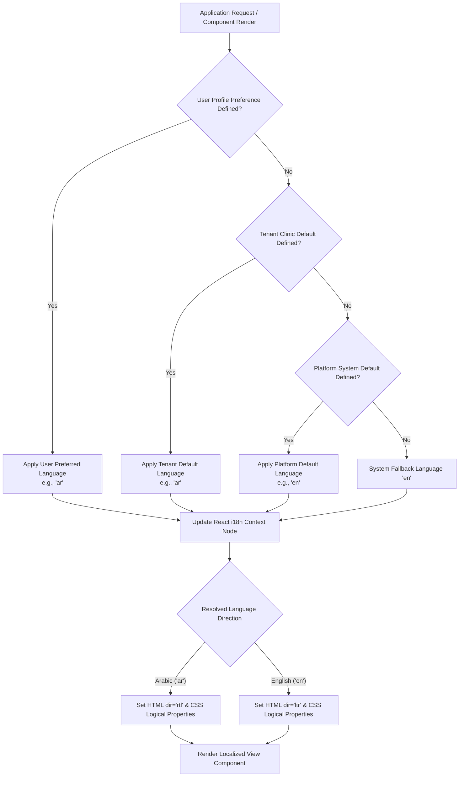
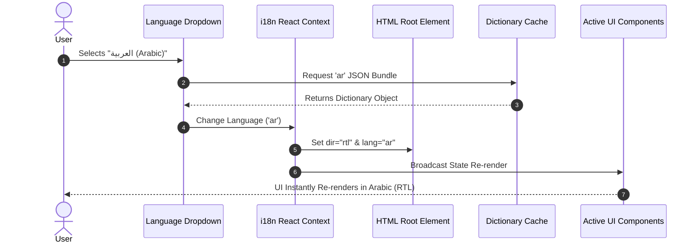
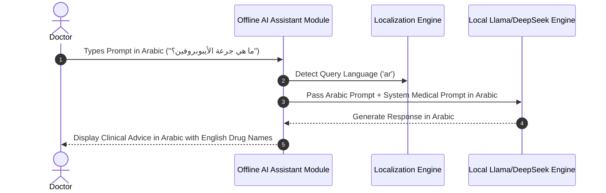
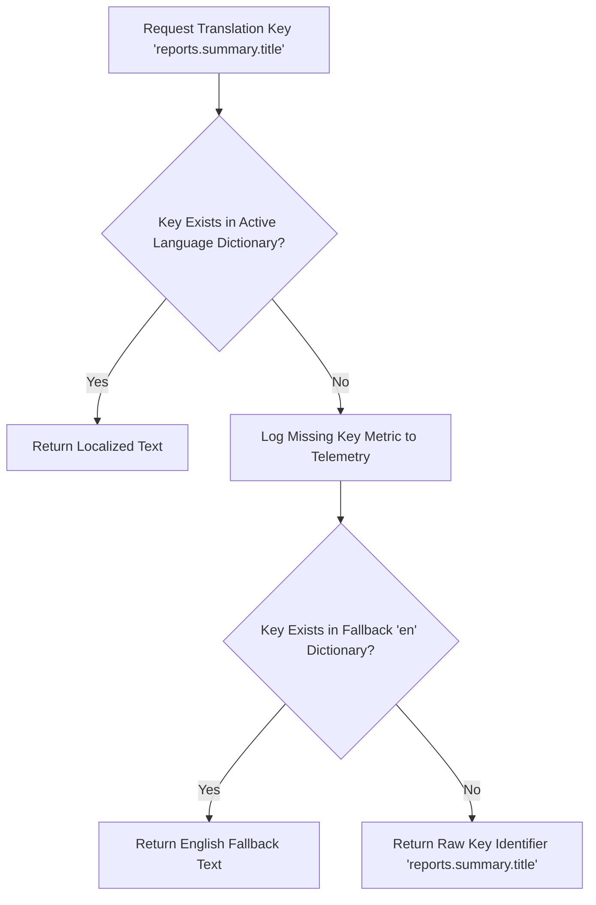

# Module-020: Enterprise Localization System User Flow Design

## 1. Executive Summary & Flow Architecture

The **Enterprise Localization System User Flow Specification** documents all interactive workflows, state transitions, language resolution cascades, and bidirectional UI layout adaptation loops for Module-020. The system guarantees instantaneous, hot runtime language toggling between **Arabic (`ar`, RTL)** and **English (`en`, LTR)** without application restarts or web page reloads.

---

## 2. Language Preference Resolution Hierarchy & Cascade

---

## 3. Core User Flows (17 Standardized Workflows)

### Flow 01: First Application Launch & Startup Preference Resolution
1. **App Initiation**: Client application boots in desktop Tauri window or browser context.
2. **Session Verification**: The auth context inspects active local storage or secure desktop key store for existing session tokens.
3. **Unauthenticated Resolution**: If unauthenticated, the application queries browser/OS locale settings and falls back to Platform Default (`en`).
4. **Authenticated Resolution**: If authenticated, the system fetches the user profile `preferredLanguage` (e.g., `ar`).
5. **DOM Attribute Binding**: Binds `<html dir="rtl" lang="ar">`, loads Arabic dictionary JSON, and renders the initial dashboard.

---

### Flow 02: Manual Language Change (Hot Runtime Switch)
1. **Trigger**: User clicks Language Selector in Header Navigation.
2. **Selection**: User chooses "العربية (Arabic)" or "English".
3. **Async Dictionary Loading**: The client i18n manager loads the target dictionary bundle if not cached.
4. **Context Emission**: Fires i18n state change signal to top-level React Context.
5. **Directional Adjustment**: Flips HTML `dir` attribute (`rtl` ↔ `ltr`) and updates global CSS CSS variables.
6. **Stateful Re-render**: Active view components, open modal dialogs, and navigation drawers re-render dynamically without losing input draft state or triggering web page refresh.
7. **Persistence**: Dispatches background API mutation to persist `preferredLanguage` to user profile in MongoDB.

---

### Flow 03: Localized Authentication & Session Initiation
1. **Login Page Load**: Visitor accesses `/login`. System loads default platform language.
2. **Language Toggle Available**: Visitor can select language from login page header.
3. **Credentials Submission**: Visitor submits credentials. Backend validates Argon2id password hash.
4. **Profile Hydration**: JWT response payload returns user profile attributes including `preferredLanguage`.
5. **Seamless Transition**: System updates i18n context to user preference prior to dashboard redirection.

---

### Flow 04: Tenant Default Language Provisioning & Inheritance
1. **Tenant Onboarding**: Platform Owner creates a new clinic tenant via Platform Control Panel.
2. **Default Setting**: Administrator specifies Tenant Default Language (`tenant.defaultLanguage = 'ar'`).
3. **Staff Onboarding**: When new clinic staff members are created, their initial language preference inherits the Tenant Default.
4. **Override Preservation**: Existing staff members who manually selected a personal language preference maintain their explicit choice.

---

### Flow 05: Platform Default Language Configuration
1. **Global Configuration**: Platform Owner updates Global Configuration (`configuration.minimumDesktopVersion`, `configuration.defaultLanguage = 'en'`).
2. **Anonymous Access**: Anonymous visitors on Public Booking Portal inherit new global default.
3. **Authenticated Immunity**: Authenticated clinics and staff members remain on their configured tenant/user preferences.

---

### Flow 06: User Preference Override Cascade
1. **User Action**: Individual doctor changes preferred language from English to Arabic in Profile Settings.
2. **Hierarchy Precedence**: System elevates User Preference above Tenant Default.
3. **Persistent Sync**: Saves preference locally in Tauri secure storage and sends API update to `/api/v1/auth/preferences`.

---

### Flow 07: Zero-State Runtime Component & React Context Refresh

---

### Flow 08: Bidirectional Layout Adaptation (RTL / LTR System Mirroring)
1. **Direction Change Detected**: i18n engine detects transition from `ltr` to `rtl`.
2. **CSS Logical Property Calculation**:
   - `margin-inline-start` switches from left margin to right margin.
   - `padding-inline-end` switches from right padding to left padding.
   - Table columns mirror automatically (`Name` aligns Right, `Actions` align Left).
3. **Iconography Mirroring**: Directional arrows (`ChevronRight` ↔ `ChevronLeft`) flip horizontally. Neutral iconography (`Heart`, `User`, `FileText`) remains unaltered.

---

### Flow 09: Localized System Notifications & Toast Alerts
1. **Event Trigger**: Backend emits event (e.g., `APPOINTMENT_CANCELLED`).
2. **Template Lookup**: Client notification worker receives event code and looks up key `notifications.appointment_cancelled`.
3. **Dynamic Interpolation**: Interpolates variables (e.g., patient name, appointment time).
4. **Toast Render**: Displays toast message formatted in active language with correct text alignment.

---

### Flow 10: Localized Input Validation & Form Feedback
1. **User Input**: User submits patient registration form with invalid email.
2. **Validation Layer**: Form validator triggers rule `ERR_INVALID_EMAIL`.
3. **Message Resolution**: Fetches localized string `validation.invalid_email`.
4. **Inline Render**: Displays error snippet directly below target input field with RTL/LTR text alignment.

---

### Flow 11: Localized System Exception & Recovery Guidance
1. **Runtime Error**: Network connection drops during synchronization.
2. **Error Interceptor**: API client intercepts HTTP 503 error response.
3. **Localized Modal**: Displays error overlay using key `errors.sync_gateway_offline`.
4. **Actionable Guidance**: Provides localized recovery buttons (`common.actions.retry`, `common.actions.offline_mode`).

---

### Flow 12: Offline AI Assistant Multilingual Conversation Loop

---

### Flow 13: Localized Medical Report Generation & PDF Formatting
1. **Request**: Doctor clicks "Print Medical Summary".
2. **Language Resolution**: Report generator checks active language or report-specific target language.
3. **Font Embedding**: PDF canvas embeds Cairo Arabic WOFF2 font bytes.
4. **BiDi Text Layout**: Complex Text Layout engine arranges Arabic narrative with English diagnostic codes (e.g., `ICD-10: J00`).
5. **PDF Rendering**: Produces vector PDF ready for download or desktop printing.

---

### Flow 14: Localized Thermal & Document Printing Pipeline
1. **Print Command**: Receptionist prints payment receipt on thermal printer.
2. **Template Selection**: Selection of localized thermal receipt layout (`receipt_template_ar.html`).
3. **Print Execution**: Native Tauri desktop spooler sends pre-rendered bitmap/vector layout to thermal device.

---

### Flow 15: Public Online Booking Portal Language Selection
1. **Visitor Entry**: Patient visits clinic online booking URL `/book/clinic-default`.
2. **Language Detection**: Booking portal inspects HTTP `Accept-Language` header and applies clinic default.
3. **Header Switcher**: Patient uses header selector to switch between Arabic and English.
4. **Step Retention**: Switching language maintains selected doctor, service, and time slot choices.

---

### Flow 16: Missing Translation Key Resilience & Fallback Hierarchy

---

### Flow 17: V2 Language Pack Installation & Publishing (Reservation)
1. **Upload**: Administrator uploads language pack file (`fr-FR.json`).
2. **Validation**: System validates JSON schema, missing key delta, and metadata integrity.
3. **Registration**: Language is registered in `global_configuration.supportedLanguages`.
4. **Publication**: Language immediately becomes selectable across the platform.

---

## 4. Accessibility (WCAG 2.1 AA) Flow Protections

1. **Screen Reader Announcement**: When language changes, an ARIA live region announces `"Language changed to Arabic"` / `"تم تغيير اللغة إلى العربية"`.
2. **Focus Management**: Focus remains on the language selector dropdown after selection to prevent keyboard focus loss.
3. **Keyboard Shortcuts**: Global shortcut `Ctrl + Shift + L` cycles through available languages.

---

## 5. Verification & Compliance Checklist

- [x] All 17 core user flows documented with step-by-step logic.
- [x] Mermaid sequence and flowchart diagrams created.
- [x] Bidirectional RTL/LTR layout adaptation and CSS logical property rules integrated.
- [x] Offline AI Assistant multilingual loop specified.
- [x] Missing key fallback resiliency verified.
- [x] WCAG 2.1 AA screen reader accessibility protected.
- [x] Zero Emojis policy enforced.
