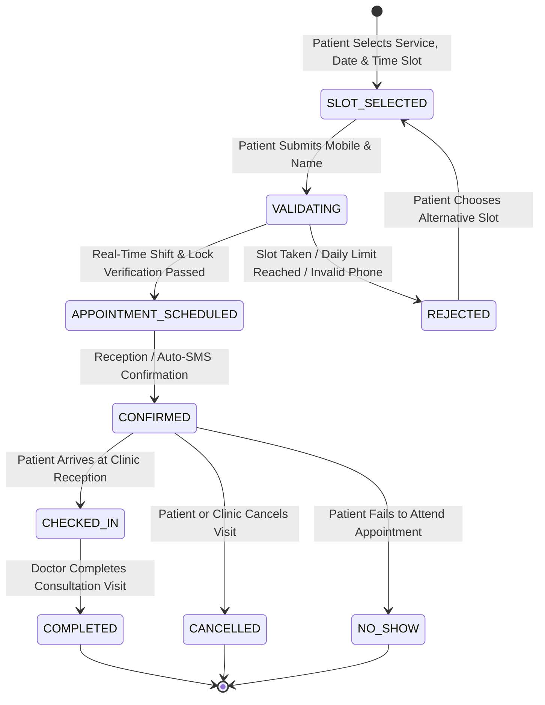
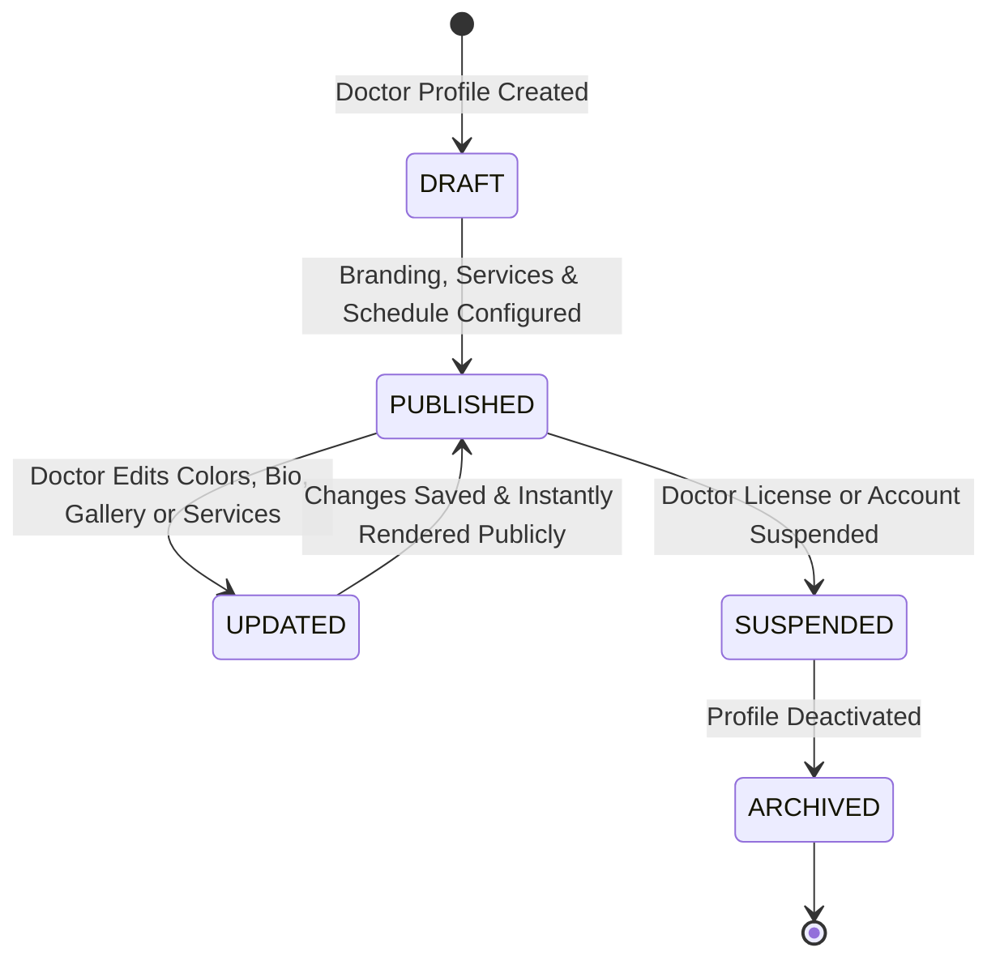

# Online Booking Portal User Flow & Workflow Architecture — ClinicOS

## 1. Executive Summary & Workflow Principles

The **Online Booking Portal (Module-015)** provides user interaction journeys, public patient acquisition workflows, and dashboard management capabilities for **ClinicOS**.

Operating on a **Mobile-First Public Web Architecture**, the workflow engine ensures that public patient booking is effortless, instant, and real-time validated against doctor shifts, while doctor branding and portal configurations can be updated 100% dynamically from the private Doctor Dashboard without developer intervention.

```
+-----------------------------------------------------------------------------------+
|                           PUBLIC PATIENT JOURNEY FLOW                             |
|  [Open URL / Scan QR] -> [Browse Doctor Profile] -> [Select Service & Time Slot] |
|                                                                 |                 |
|                                                                 v                 |
|  [Instant SMS/Email Confirmation] <- [Real-Time Validation] <- [Enter Details]    |
+-----------------------------------------------------------------------------------+
                                           |
                                           v
+-----------------------------------------------------------------------------------+
|                        INTERNAL CLINIC MANAGEMENT SYNC                            |
|  [Appointments Module] <-> [Reception Roster Sync] <-> [Audit Event Emitted]     |
+-----------------------------------------------------------------------------------+
```

### Core Workflow Principles
1. **Zero-Code Dashboard Control**: Every public element (colors, photos, services, FAQs, Working Hours) is controlled from the Doctor Dashboard. Updates reflect publicly upon saving.
2. **Atomic Double-Booking Prevention**: Slot reservation uses real-time atomic locking (`X-Tenant-ID` scoping) to eliminate race conditions between online patients and reception walk-ins.
3. **Mobile-First One-Hand Navigation**: Workflows are optimized for single-thumb navigation on mobile viewports (320px-480px), featuring sticky action bars and bottom-sheet pickers.
4. **Strict PHI Isolation Barrier**: Public visitors only interact with public booking schedules. Internal clinical charts, diagnoses, and financial ledgers remain 100% inaccessible.
5. **Zero Emojis & Complete Auditability**: Iconography strictly adheres to Lucide React SVG components. Every public booking attempt and portal modification writes an immutable audit log record.

---

## 2. Portal Lifecycle State Machines

### 2.1 Public Booking Lifecycle State Machine


### 2.2 Doctor Public Profile Publication Lifecycle


---

## 3. Core Execution Workflows

### 3.1 FLOW-001: Public Visitor Navigation & Discovery Flow
1. **Trigger**: Patient opens public URL `https://clinic.com/book/dr-ahmed` or scans clinic QR code.
2. **System Processing**:
   - Fetches public doctor profile, active branding tokens, services catalog, gallery, and schedule.
   - Injects OpenGraph metadata and Schema.org JSON-LD (`Physician` & `MedicalBusiness`) into document head.
3. **User Action**: Patient scrolls through Hero Section, Doctor Identity Card, Bio, Services, Gallery, Certifications, Reviews, and Location Map.
4. **Outcome**: Patient decides to initiate booking by tapping "Book Appointment" or tapping a specific service "Book Service" button.

---

### 3.2 FLOW-002: Appointment Booking & Slot Reservation Flow
1. **Trigger**: Patient taps "Book Appointment".
2. **UI Step 1 (Select Service)**: Patient selects desired service (e.g. `Cardiology Consultation - 30 mins - 350 EGP`).
3. **UI Step 2 (Select Date)**: Interactive calendar displays available shift days (highlighted). Days with full bookings or approved doctor leaves are disabled.
4. **UI Step 3 (Select Time Slot)**: Patient selects from a grid of open 30-minute time slots (e.g. `17:30 - 18:00`).
5. **UI Step 4 (Patient Details)**: Patient inputs:
   - Full Name (Required, 3-80 chars)
   - Mobile Number (Required, E.164 regional validation)
   - Email Address (Optional)
   - Visit Notes / Symptoms (Optional, max 250 chars)
6. **Submission**: Patient taps "Confirm Booking".

---

### 3.3 FLOW-003: Real-Time Booking Validation Flow
```
[Patient Taps Confirm Booking]
              |
              v
[1. Check IP Rate Limit (Max 5/hr)] ----> (Exceeded? -> EF-005 Error)
              |
              v
[2. Validate Mobile Regex & Honeypot] ---> (Invalid? -> EF-006 Error)
              |
              v
[3. Check Doctor Shifts & Vacations] ----> (Closed/Leave? -> EF-003 Error)
              |
              v
[4. Check Max Daily Appointments Cap] ---> (Full? -> EF-004 Error)
              |
              v
[5. Execute Atomic Concurrency Lock] ----> (Conflict? -> EF-007 Error)
              |
              v
[6. Insert Appointment & Dispatch Sync] -> Success (APT-YYYYMM-XXXXX)
```

---

### 3.4 FLOW-004: Doctor Dashboard Configuration & Live Preview Flow
1. **Trigger**: Doctor opens `Dashboard -> Booking Portal Settings`.
2. **User Action**: Doctor edits profile bio, title, consultation fee, or custom URL slug (`dr-ahmed`).
3. **Live Preview Engine**: The right-hand preview panel immediately updates the mobile layout preview simulator in real-time.
4. **Save Action**: Doctor clicks "Publish Changes".
5. **Outcome**: Settings persist in `doctor_portal_settings` collection, instantly updating the live public website.

---

### 3.5 FLOW-005: Visual Branding Customization Flow
1. **Trigger**: Doctor opens `Dashboard -> Booking Portal -> Branding`.
2. **User Action**: Doctor uploads custom Hero Cover Banner and Doctor Avatar photo.
3. **Color Picker**: Doctor selects Primary Color (e.g. Emerald `#047857`), Secondary Color (Slate `#0F172A`), and Accent Color (Amber `#F59E0B`).
4. **Save Action**: Doctor clicks "Save Branding".
5. **Outcome**: Brand tokens update instantly across all public landing page components.

---

### 3.6 FLOW-006: Gallery & Credentials Management Flow
1. **Trigger**: Doctor opens `Dashboard -> Booking Portal -> Gallery & Credentials`.
2. **User Action**: Doctor uploads clinic reception, treatment room photos, and board certification documents.
3. **Reordering**: Doctor drags and drops gallery items to adjust display order.
4. **Outcome**: Gallery and Credentials cards render on public portal with lightbox viewing capability.

---

### 3.7 FLOW-007: Patient Testimonials & Moderation Flow *(V1 Local / V2 Moderation)*
1. **Trigger**: Verified patient completes appointment visit.
2. **Submission**: Patient receives post-visit SMS link to rate experience (1-5 Stars + Optional Comment).
3. **Doctor Review Gate**: Review appears in Doctor Dashboard `Testimonials Manager`.
4. **Action**: Doctor toggles "Feature on Public Page" or "Hide Review".
5. **Outcome**: Featured reviews update overall rating summary on public landing page.

---

### 3.8 FLOW-008: FAQ Builder Flow
1. **Trigger**: Doctor opens `Dashboard -> Booking Portal -> FAQ Manager`.
2. **User Action**: Doctor adds question (e.g. `What is the follow-up policy?`) and answer.
3. **Ordering**: Doctor sets accordion display order.
4. **Outcome**: FAQ section updates dynamically on the public portal.

---

### 3.9 FLOW-009: SEO & Custom Slug Management Flow
1. **Trigger**: Doctor opens `Dashboard -> Booking Portal -> SEO Settings`.
2. **User Action**: Doctor modifies custom URL slug (e.g. from `dr-ahmed-102` to `dr-ahmed`), custom Meta Title, and Meta Description.
3. **Validation**: System checks slug uniqueness across workspace.
4. **Outcome**: Public route updates to `clinic.com/book/dr-ahmed`, registering a 301 redirect for the old slug.

---

### 3.10 FLOW-010: One-Tap Contact & Map Navigation Flow
1. **Trigger**: Public visitor taps "Call Clinic" or "Get Directions".
2. **Phone Action**: Invokes native device dialer (`tel:+201000000000`).
3. **Map Action**: Launches Google Maps application with exact clinic lat/long coordinates.

---

### 3.11 FLOW-011: Real-Time Notification & Reception Sync Flow
1. **Trigger**: Public booking successfully confirmed (`APT-YYYYMM-XXXXX`).
2. **System Processing**:
   - Dispatches SMS/Email confirmation to patient with booking details.
   - Pushes real-time WebSocket check-in banner notification to Clinic Reception Dashboard.
   - Emits structured audit record (`PUBLIC_BOOKING_CREATED`).

---

### 3.12 FLOW-012: Online Payment & Prepayment Deposit Flow *(Reserved V2 Roadmap)*
1. **Trigger**: Patient selects slot for service requiring deposit.
2. **Processing**: Redirects to secure payment gateway (Paymob / Stripe / Fawry).
3. **Confirmation**: Upon successful transaction webhook, appointment status transitions to `CONFIRMED_PAID`.

---

### 3.13 FLOW-013: WhatsApp Confirmation & Reminder Bot Flow *(Reserved V2 Roadmap)*
1. **Trigger**: Public booking created.
2. **Processing**: System dispatches automated WhatsApp message template with interactive "Confirm" and "Reschedule" buttons.

---

## 4. RBAC & Visibility Permission Matrix

| Role | View Public Portal | Book Public Slot | Edit Portal Branding & Bio | Edit Schedule & Services | View Internal Medical Charts |
| --- | --- | --- | --- | --- | --- |
| **Public Visitor** | `ALLOWED` | `ALLOWED` | `FORBIDDEN` | `FORBIDDEN` | `FORBIDDEN` |
| **Doctor** | `ALLOWED` | `ALLOWED` | `ALLOWED` | `ALLOWED` | `ALLOWED` |
| **Receptionist** | `ALLOWED` | `ALLOWED` | `FORBIDDEN` | `VIEW_ONLY` | `FORBIDDEN` |
| **Clinic Manager** | `ALLOWED` | `ALLOWED` | `ALLOWED` | `ALLOWED` | `FORBIDDEN` |
| **SUPER_ADMIN (Platform)** | `ALLOWED` | `FORBIDDEN` | `FORBIDDEN (Clinic Data)` | `FORBIDDEN` | `FORBIDDEN` |

---

## 5. Exception Flow Catalog (10 Error Paths)

### EF-001: Page Not Found (Invalid Doctor Slug)
- **Cause**: Visitor enters non-existent URL (e.g. `clinic.com/book/unknown-doctor`).
- **Handling**: Renders friendly 404 page: "Doctor Profile Not Found. Search Directory or Contact Clinic."

### EF-002: Doctor Suspended / Deactivated Profile
- **Cause**: Doctor account status is `SUSPENDED` or `ARCHIVED`.
- **Handling**: Renders 410 Gone page: "This doctor profile is currently unavailable." Zero internal details exposed.

### EF-003: Clinic Closed / Emergency Holiday
- **Cause**: Selected date falls on official clinic holiday or emergency closure.
- **Handling**: Calendar disables holiday date with tooltip: "Clinic Closed for Emergency / Holiday."

### EF-004: Maximum Daily Appointments Exceeded
- **Cause**: Selected date has reached doctor's `maxDailyAppointments` limit.
- **Handling**: Date displays status: "Fully Booked for Selected Date. Please choose another date."

### EF-005: IP Rate Limit / Spam Throttling Triggered
- **Cause**: Visitor exceeds 5 booking attempts per hour from same IP.
- **Handling**: Displays warning banner: "Too many booking requests. Please wait 15 minutes before trying again."

### EF-006: Invalid Mobile Phone Format
- **Cause**: Patient enters invalid phone number (e.g. `12345`).
- **Handling**: Form highlights input with error: "Please enter a valid mobile number with country code."

### EF-007: Atomic Concurrency Lock Conflict (Simultaneous Booking)
- **Cause**: Two patients attempt to book the exact same slot at the exact same millisecond.
- **Handling**: Second booking receives alert: "This time slot was just booked by another patient. Please select another slot."

### EF-008: Network Disconnection During Booking
- **Cause**: Patient loses internet connection while submitting booking drawer.
- **Handling**: Toast notification: "Connection lost. Reconnecting... Your selected slot is held for 2 minutes."

### EF-009: Permission Denied (Platform Owner Barrier)
- **Cause**: `SUPER_ADMIN` attempts to edit clinic branding via API.
- **Handling**: Returns `403 Forbidden` error code `PLATFORM_ADMIN_BRANDING_RESTRICTED`.

### EF-010: Portal Disabled by Doctor
- **Cause**: Doctor toggles "Disable Public Online Booking" in dashboard settings.
- **Handling**: Public page displays doctor profile, services, and location, but replaces booking button with "Call Clinic to Book".

---

## 6. Mobile-First UX Strategy & Touch Patterns

1. **Sticky Bottom Action Bar**: Mobile viewports feature a fixed bottom navigation bar with "Book Appointment" CTA always visible during scrolling.
2. **Bottom-Sheet Time Slot Selection**: Tapping a calendar date opens a native-feeling slide-up bottom sheet for slot selection.
3. **Touch Targets**: Minimum touch target dimensions of 44x44px for easy single-thumb interaction.
4. **Form Ergonomics**: Automatic input focus, virtual keyboard optimization (`inputmode="tel"` for phone), and auto-formatting.

---

## 7. Reserved Future Workflow Extensions

*Note: For documentation only. Do NOT implement in Version 1.*

1. **Online Payments & Deposit Checkout**: Integrated Stripe / Paymob checkout before slot finalization.
2. **WhatsApp Bot Auto-Reminders**: Two-way interactive WhatsApp notifications 24 hours prior to visit.
3. **SMS OTP Mobile Verification**: Mandatory 4-digit SMS OTP code input before slot reservation.
4. **Telehealth Video Consultations**: Embedded WebRTC video call links in booking confirmation.
5. **AI Chat Assistant**: Conversational AI bot answering patient questions and scheduling visits.
