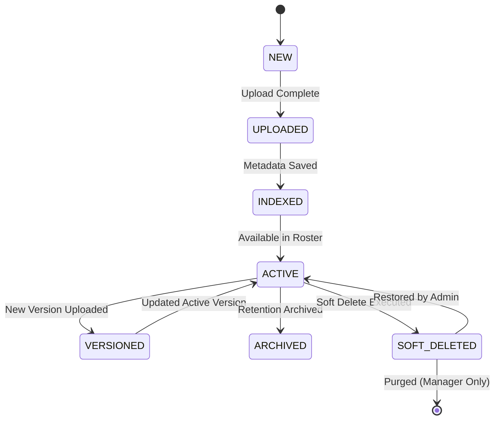

# Module-016 — Patient Files & Attachments User Flow Design

## Executive Summary

The **Patient Files & Attachments User Flow Specification** documents all interactive user journeys, state transitions, exception handling catalogs, mobile camera upload workflows, and security permission guards for the Patient Files & Attachments Module (Module-016).

This specification guarantees seamless operation for clinical and administrative staff while protecting patient privacy and ensuring compliance with HIPAA, zero data overwrite policies, and immutable version tracking.

---

## 1. Core User Workflows

### Flow 1: Upload Attachment Flow
```
Open Patient Profile
        │
        ▼
Select "Attachments" Tab
        │
        ▼
Click "Upload Attachment" Button / Drag-and-Drop File
        │
        ▼
Client-Side Validation (MIME Type, File Size Limit)
        │
        ▼
Select Category (Lab Result, Radiology, Prescription, etc.)
        │
        ▼
Enter Optional Description & Custom Tags (#urgent, #cardiology)
        │
        ▼
Click "Confirm & Upload"
        │
        ▼
Backend Ingests Binary Stream ➔ Decoupled Storage Driver (Local/S3/NAS)
        │
        ▼
Persist BSON Metadata Record (version: 1, status: ACTIVE)
        │
        ▼
Dispatch Audit Log Event ("ATTACHMENT_UPLOADED")
        │
        ▼
Dispatch Clinical Timeline Event ("PATIENT_ATTACHMENT_UPLOADED")
        │
        ▼
Real-Time UI Roster Refresh with Success Toast
```

---

### Flow 2: Multi-Format Preview Flow
```
Open Patient Attachments Roster
        │
        ▼
Click "Preview" Icon / Double-Click Attachment Card
        │
        ▼
Validate User RBAC Permissions
        │
        ▼
Evaluate File MIME Type:
  ├── Image (JPG, PNG, WEBP) ──► Render Interactive Lightbox Modal (Zoom/Rotate)
  ├── PDF Document ──────────► Render Embedded PDF Viewer (Page Nav/Text Search)
  └── Other (DOCX, ZIP) ──────► Render Rich Metadata Card (Size, Hash, Download Action)
        │
        ▼
Dispatch Audit Log Event ("ATTACHMENT_PREVIEWED")
```

---

### Flow 3: Secure Download Flow
```
Select Attachment ──► Click "Download" Button
        │
        ▼
Validate User RBAC & Tenant Isolation
        │
        ▼
Evaluate Storage Engine (Presigned Cloud URL or Stream Response)
        │
        ▼
Initiate Secure Binary Download
        │
        ▼
Dispatch Audit Log Event ("ATTACHMENT_DOWNLOADED")
```

---

### Flow 4: Immutable File Replacement & Version Control Flow
```
Open Attachment Options Menu ──► Click "Upload New Version"
        │
        ▼
Select New File ──► Client-Side Validation
        │
        ▼
Upload New Binary Stream to Storage Driver
        │
        ▼
Update Previous Record: (isLatestVersion = false)
        │
        ▼
Create New Metadata Record: (version = N+1, parentAttachmentId = prevId, isLatestVersion = true)
        │
        ▼
Dispatch Audit Log Event ("ATTACHMENT_VERSION_CREATED")
        │
        ▼
Update UI Displaying Version Badge ("v2", "v3")
```

---

### Flow 5: Rename Attachment Flow
```
Select Attachment ──► Click "Rename"
        │
        ▼
Enter New Display Title ──► Validate Input (no special characters/slashes)
        │
        ▼
Update Metadata Record (`originalFileName`)
        │
        ▼
Dispatch Audit Log Event ("ATTACHMENT_RENAMED")
```

---

### Flow 6: Category Reassignment Flow
```
Select Attachment ──► Click "Change Category"
        │
        ▼
Select New Category from Configurable Dropdown
        │
        ▼
Update Metadata Record (`category`)
        │
        ▼
Dispatch Audit Log Event ("ATTACHMENT_CATEGORY_CHANGED")
```

---

### Flow 7: Tag Management & Multi-Index Search Flow
```
Select Attachment ──► Click "Edit Tags"
        │
        ▼
Add/Remove Tags (e.g. #blood_work, #followup_2026)
        │
        ▼
Save Tag Array ──► Update Multi-Key Search Index
```

---

### Flow 8: Soft Delete Flow
```
Select Attachment ──► Click "Delete"
        │
        ▼
Render Confirmation Modal ("Soft delete attachment?")
        │
        ▼
Confirm ──► Update Metadata (`status = 'SOFT_DELETED'`, `deletedAt`, `deletedBy`)
        │
        ▼
Dispatch Audit Log Event ("ATTACHMENT_SOFT_DELETED")
        │
        ▼
Hide Attachment from Standard Roster (Preserved in Trash View)
```

---

### Flow 9: Restore Deleted Attachment Flow
```
Open "Trash / Deleted Attachments" View
        │
        ▼
Select Soft-Deleted Attachment ──► Click "Restore"
        │
        ▼
Update Metadata (`status = 'ACTIVE'`, clear `deletedAt`)
        │
        ▼
Dispatch Audit Log Event ("ATTACHMENT_RESTORED")
        │
        ▼
Attachment Re-Appears in Active Roster
```

---

### Flow 10: Multi-Parameter Search & Filter Flow
```
User Enters Search Bar / Opens Filter Panel
        │
        ▼
Specify Parameters (Search Query, Category Filter, Date Range, Tags)
        │
        ▼
Execute Covered Mongo Query Index
        │
        ▼
Render Filtered Attachment Roster with Item Count Badge
```

---

### Flow 11: Patient Clinical Timeline Sync Flow
```
Open Patient Profile ──► Select "Clinical Timeline" Tab
        │
        ▼
View Chronological Events (Consultations, Prescriptions, Attachments)
        │
        ▼
Attachment Events Rendered with Category Badge & Direct Preview Button
```

---

### Flow 12 & 13: Reserved V2 OCR & AI Classification Flows (Document Only)
- **OCR Flow**: File Upload ➔ Background Worker Queue ➔ Extract Text Content ➔ Index in Full-Text Search ➔ Save OCR Transcript.
- **AI Classification Flow**: File Upload ➔ ML Document Classifier ➔ Suggest Category & Tags ➔ Staff One-Tap Approval ➔ Save.

---

## 2. Attachment State Machine Lifecycle



---

## 3. Exception Flow Catalog (EF-001 to EF-010)

| ID | Exception Trigger | System Recovery & UI Response |
| --- | --- | --- |
| **EF-001** | Unsupported File MIME Type | Reject upload, highlight format rules, display toast: *"Unsupported file format. Please upload PDF, JPG, PNG, WEBP, or DOCX."* |
| **EF-002** | File Size Limit Exceeded | Client validation aborts upload immediately: *"File exceeds maximum limit (50MB for PDF / 15MB for Images)."* |
| **EF-003** | Clinic Storage Quota Full | Block upload, notify Clinic Admin: *"Storage quota reached. Please upgrade storage tier or archive files."* |
| **EF-004** | Network Upload Interrupted | Offer one-click retry button with chunked upload resume. |
| **EF-005** | Corrupted Binary Stream | SHA-256 checksum mismatch aborts ingestion: *"File integrity verification failed."* |
| **EF-006** | Permission Denied | Display security alert modal and record security log. |
| **EF-007** | Download Stream Interrupted | Provide automatic download resume option. |
| **EF-008** | Version Lock Conflict | Concurrent upload warning: *"A newer document version was uploaded. Refreshing roster..."* |
| **EF-009** | Physical File Missing on Storage | Log critical error, inform staff, offer restore from backup pipeline. |
| **EF-0010** | Restore Deleted File Failure | Render notification: *"Unable to restore file. File entry modified by another session."* |

---

## 4. Mobile & Touch-First Camera Upload Workflows

1. **Native Camera Capture**: Mobile web UI triggers device camera (`capture="environment"`) to scan paper lab reports directly.
2. **Auto-Crop & Brightness Assist**: Client-side canvas preprocessing adjusts contrast for document legibility before upload.
3. **Single-Hand Touch Gestures**: Swipe right for quick preview, swipe left for actions menu, swipe down to dismiss lightbox.

---

## 5. Granular RBAC Permission Matrix

| Role | Upload | Preview | Download | Replace/Version | Soft Delete | Restore |
| --- | --- | --- | --- | --- | --- | --- |
| **Doctor** | `ALLOWED` | `ALLOWED` | `ALLOWED` | `ALLOWED` | `ALLOWED` | `ALLOWED` |
| **Clinic Admin** | `ALLOWED` | `ALLOWED` | `ALLOWED` | `ALLOWED` | `ALLOWED` | `ALLOWED` |
| **Receptionist** | `CONFIGURABLE` | `CONFIGURABLE` | `CONFIGURABLE` | `DENIED` | `DENIED` | `DENIED` |
| **Nurse** | `ALLOWED` | `ALLOWED` | `ALLOWED` | `ALLOWED` | `DENIED` | `DENIED` |
| **Platform Owner (`SUPER_ADMIN`)** | `RESTRICTED` | `RESTRICTED` | `RESTRICTED` | `RESTRICTED` | `RESTRICTED` | `RESTRICTED` |

> [!IMPORTANT]
> **Platform Owner Security Barrier (`PLATFORM_ADMIN_ATTACHMENTS_RESTRICTED`)**:
> `SUPER_ADMIN` and `PLATFORM` tenant users attempting to view, preview, or download patient attachments are blocked with a `403 Forbidden` error.

---

## 6. Reserved V2 Extension Workflows (Document Only)

- **OCR Text Search Workflow**: Extract searchable text from uploaded PDFs and lab reports.
- **AI Smart Categorization Workflow**: Automatically suggest document category based on visual features.
- **WebGL DICOM Viewer Workflow**: Render multi-slice X-Ray and CT scan datasets natively in-browser.
- **Expiring Presigned Sharing Links**: Generate 24-hour encrypted sharing links for external specialists.

---

## Deliverables & Next Step Confirmation

The user flow design for **Module-016 (Patient Files & Attachments)** is complete, fully validated, and documented.

Ready to proceed to **`TASK-148` — Patient Files & Attachments Database Design**.
