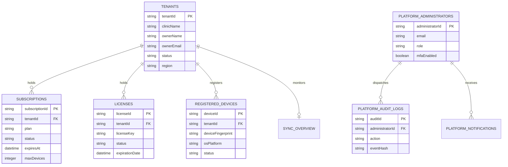

# Platform Control Panel Database Architecture

## Module Overview

This document specifies the complete MongoDB database schema design, BSON collection specifications, index strategies, constraint matrices, and multi-tenant isolation rules for the **Platform Control Panel** (Module-019).

The Platform Database manages the **SaaS infrastructure itself** (clinics, subscriptions, licenses, devices, platform administrators, and global telemetry). It is **strictly isolated** from clinic-owned business and medical databases. No patient medical records, clinical notes, or prescriptions are stored in or accessible from the Platform Control Panel Database.

---

## ER Diagram & Isolation Architecture



---

## MongoDB BSON Master Collections

### 1. `platform_administrators`
```json
{
  "_id": "admin_super_01",
  "administratorId": "admin_super_01",
  "fullName": "Platform Owner Admin",
  "email": "owner@clinicos.enterprise",
  "passwordHash": "$argon2id$v=19$m=65536,t=3,p=4$hash_string",
  "role": "SUPER_ADMIN",
  "mfaEnabled": true,
  "mfaSecretEncrypted": "enc_mfa_secret_string",
  "status": "ACTIVE",
  "lastLoginAt": "2026-08-02T19:30:00.000Z",
  "createdAt": "2026-01-01T00:00:00.000Z",
  "updatedAt": "2026-08-02T19:30:00.000Z"
}
```

### 2. `tenants`
```json
{
  "_id": "tenant-default",
  "tenantId": "tenant-default",
  "clinicId": "clinic-default",
  "clinicName": "Al-Mansoor Specialist Clinic",
  "ownerName": "Dr. Ahmed Mansoor",
  "ownerEmail": "doctor@almansoor-clinic.com",
  "subscriptionId": "sub_prof_01",
  "licenseId": "lic_99102",
  "status": "ACTIVE",
  "region": "EG-CAIRO",
  "timezone": "Africa/Cairo",
  "createdAt": "2026-01-01T00:00:00.000Z",
  "updatedAt": "2026-08-02T19:00:00.000Z"
}
```

### 3. `subscriptions`
```json
{
  "_id": "sub_prof_01",
  "subscriptionId": "sub_prof_01",
  "tenantId": "tenant-default",
  "plan": "ENTERPRISE_YEARLY",
  "billingCycle": "YEARLY",
  "status": "ACTIVE",
  "startedAt": "2026-01-01T00:00:00.000Z",
  "expiresAt": "2027-01-01T00:00:00.000Z",
  "maxDevices": 10,
  "maxUsers": 15,
  "storageLimitMb": 102400,
  "autoRenew": true,
  "updatedAt": "2026-01-01T00:00:00.000Z"
}
```

### 4. `licenses`
```json
{
  "_id": "lic_99102",
  "licenseId": "lic_99102",
  "tenantId": "tenant-default",
  "licenseKey": "LIC-2026-CLINICOS-ENTERPRISE-891234",
  "status": "ACTIVE",
  "activationDate": "2026-01-01T00:00:00.000Z",
  "expirationDate": "2027-01-01T00:00:00.000Z",
  "deviceLimit": 10,
  "activationCount": 2,
  "lastValidatedAt": "2026-08-02T19:30:00.000Z"
}
```

### 5. `registered_devices`
```json
{
  "_id": "dev_pc_doctor_01",
  "deviceId": "dev_pc_doctor_01",
  "tenantId": "tenant-default",
  "deviceName": "Dr. Mansoor PC (Room 1)",
  "deviceFingerprint": "hw_hash_a8f9001b223c4d5e",
  "operatingSystem": "WINDOWS_11_X64",
  "applicationVersion": "1.0.0",
  "lastHeartbeatAt": "2026-08-02T19:31:30.000Z",
  "lastSynchronizationAt": "2026-08-02T19:30:02.000Z",
  "status": "ACTIVE",
  "createdAt": "2026-01-02T10:00:00.000Z"
}
```

### 6. `sync_overview`
```json
{
  "_id": "so_tenant_default",
  "syncOverviewId": "so_tenant_default",
  "tenantId": "tenant-default",
  "activeDevices": 2,
  "lastSuccessfulSync": "2026-08-02T19:30:02.000Z",
  "failedSynchronizations": 0,
  "pendingConflicts": 0,
  "synchronizationHealth": "OPTIMAL",
  "updatedAt": "2026-08-02T19:31:30.000Z"
}
```

### 7. `platform_notifications`
```json
{
  "_id": "pnot_10029",
  "notificationId": "pnot_10029",
  "administratorId": "admin_super_01",
  "type": "LICENSE_EXPIRING_SOON",
  "priority": "HIGH",
  "title": "Clinic License Renewal Reminder",
  "message": "Tenant tenant-default license expires in 14 days.",
  "read": false,
  "createdAt": "2026-08-02T19:00:00.000Z"
}
```

### 8. `platform_audit_logs`
```json
{
  "_id": "paudit_991823",
  "auditId": "paudit_991823",
  "administratorId": "admin_super_01",
  "action": "LICENSE_ISSUED",
  "entityType": "LICENSE",
  "entityId": "lic_99102",
  "timestamp": "2026-08-02T19:30:00.000Z",
  "ipAddress": "197.48.120.15",
  "userAgent": "Mozilla/5.0 (Windows NT 10.0; Win64; x64)",
  "eventHash": "a8f5f167f44f4964e6c998dee827110c2290123ab",
  "metadata": { "licenseKey": "LIC-2026-xxx", "maxDevices": 10 }
}
```

### 9. `platform_health`
```json
{
  "_id": "health_api_gateway",
  "healthId": "health_api_gateway",
  "service": "API_GATEWAY",
  "status": "HEALTHY",
  "responseTimeMs": 42,
  "uptimePercentage": 99.98,
  "version": "1.0.0",
  "lastCheckedAt": "2026-08-02T19:35:00.000Z"
}
```

### 10. `feature_flags`
```json
{
  "_id": "ff_p2p_mesh_sync",
  "featureId": "ff_p2p_mesh_sync",
  "featureName": "P2P_LOCAL_MESH_SYNC",
  "enabled": false,
  "tenantScope": ["tenant-beta-01"],
  "rolloutStrategy": "BETA_OPT_IN",
  "updatedAt": "2026-08-01T12:00:00.000Z"
}
```

### 11. `global_configuration`
```json
{
  "_id": "global_config_main",
  "configurationId": "global_config_main",
  "maintenanceMode": false,
  "minimumDesktopVersion": "1.0.0",
  "minimumSyncVersion": "1.0.0",
  "platformVersion": "1.0.0",
  "announcementMessage": null,
  "updatedAt": "2026-08-02T18:00:00.000Z"
}
```

---

## Indexing Strategy

- **`tenants` Index**: Unique index on `tenantId` and `ownerEmail`.
- **`licenses` Index**: Unique index on `licenseKey` and compound index `(tenantId, status)`.
- **`registered_devices` Index**: Compound covered index `(tenantId, deviceFingerprint, status)`.
- **`subscriptions` Index**: Index on `(status, expiresAt)`.
- **`platform_audit_logs` Index**: Compound index `(administratorId, timestamp, action)`.

---

## Security & Privacy Barriers

- **Patient Record Shield (`PLATFORM_ADMIN_RESTRICTED`)**: No collection inside the Platform Control Panel database contains or references patient medical records or attachment binaries.
- **Argon2 Password Hashing**: Platform administrator passphrases are hashed with Argon2id.
- **SHA-256 Audit Hashing**: Administrative actions are signed with an immutable cryptographic event hash.
