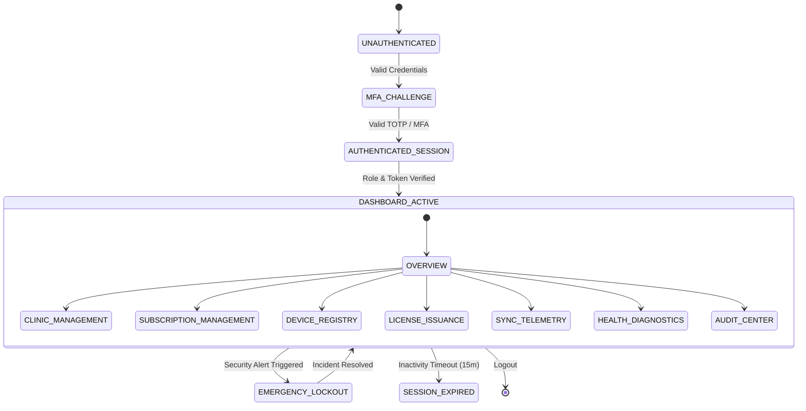

# Platform Control Panel User Flow & Lifecycle Design

## Module Overview

This document specifies the complete user flow designs, lifecycle state machines, permission matrices, error recovery catalog, and interaction models for the **Platform Control Panel** (Module-019).

The control panel is designed exclusively for the **Platform Owner** and authorized **Platform Administrators**. It manages multi-tenant clinics, licenses, registered devices, global synchronization telemetry, and infrastructure health without ever exposing clinic-owned patient medical data (`PLATFORM_ADMIN_RESTRICTED`).

---

## Platform Lifecycle State Machine

---

## Detailed Core User Flows

### 1. Platform Administrator Login & MFA Flow
1. Administrator enters credentials on `/platform/login`.
2. System validates email and argon2 hash against `platform_users`.
3. If MFA enabled, present 6-digit TOTP challenge (`/platform/mfa`).
4. Upon validation, issue signed JWT Bearer Token containing `role: SUPER_ADMIN` or `PLATFORM`.
5. Dispatch `PLATFORM_LOGIN_SUCCESS` audit event and redirect to `/platform/dashboard`.

---

### 2. Global Dashboard Telemetry Flow
1. Fetch aggregate stats: Active Clinics, Active Devices, Total Monthly Revenue, Global Sync Status.
2. Render 4 high-density metric cards and active system health pills.
3. Stream incoming security alerts and pending device registration requests.

---

### 3. Clinic Management & Telemetry Inspection Flow
1. Navigate to `/platform/clinics`.
2. Filter by status (`ACTIVE`, `SUSPENDED`, `TRIAL`, `EXPIRED`).
3. Select a clinic tenant to view business metadata, active doctor counts, and storage quotas.
4. **Privacy Barrier Enforced**: Any attempt to open patient files or clinical notes triggers `403 Forbidden` (`PLATFORM_ADMIN_RESTRICTED`).

---

### 4. Create New Clinic Onboarding Flow
1. Click `Onboard New Clinic`.
2. Fill business details (Clinic Name, Owner Email, Address, Subscription Plan).
3. Click `Provision Tenant`:
   - Generate unique `tenantId` and `clinicId`.
   - Provision default clinic settings and owner credentials.
   - Issue initial 30-day license key (`LIC-2026-xxx`).
   - Dispatch `CLINIC_PROVISIONED` audit event.
4. Email welcome credentials to clinic owner.

---

### 5. Subscription Management Flow
1. Open `/platform/subscriptions`.
2. Select target clinic tenant.
3. Choose action: `Renew Subscription`, `Upgrade Tier`, `Suspend Tenant`, `Extend Trial`.
4. System updates subscription metadata and recalculates feature limits.
5. Dispatch `SUBSCRIPTION_MUTATED` audit event.

---

### 6. Cryptographic License Management Flow
1. Open `/platform/licenses`.
2. Click `Issue License Key`.
3. Select target clinic, subscription tier, max devices (e.g. 5 PCs), and expiration date.
4. System generates 256-bit signed key string (`LIC-2026-CLINICOS-ENTERPRISE-891234`).
5. Dispatch `LICENSE_ISSUED` audit event.

---

### 7. Device Registry & Revocation Flow
1. Open `/platform/devices`.
2. View all registered desktop application instances across all clinics.
3. Search by device name, fingerprint hash, or clinic.
4. Action `Revoke Device`: Instantly invalidates device certificate token, blocking desktop sync immediately.
5. Dispatch `DEVICE_REVOKED` audit event.

---

### 8. Global Synchronization Telemetry Monitoring Flow
1. Open `/platform/sync-telemetry`.
2. Display active desktop sync connections, pending queue sizes, and conflict rates.
3. Filter clinics with stalled sync (>24h offline) for pro-active support outreach.

---

### 9. Platform Health & Infrastructure Diagnostics Flow
1. Open `/platform/health`.
2. Real-time checks: API Response Latency, MongoDB Cluster Nodes, Redis Memory, Background Worker Queue.
3. Highlight degraded components with rose amber status badges.

---

### 10. Administrator Account Management Flow
1. Open `/platform/administrators`.
2. Add new platform admin, assign RBAC role, enforce MFA setup.
3. Action `Reset Admin MFA` or `Deactivate Admin`.
4. Dispatch `ADMIN_USER_MUTATED` audit event.

---

### 11. Platform Notification Center Flow
1. Open `/platform/notifications`.
2. Review real-time system alerts (License Expirations, Storage Warnings, Unauthorized Sync Attempts).
3. Mark resolved or archive notifications.

---

### 12. Immutable Audit Center & Export Flow
1. Open `/platform/audit-center`.
2. Filter logs by Date Range, Admin ID, Target Tenant, or Action Type.
3. Verify SHA-256 cryptographic hash integrity indicator.
4. Export audit report as encrypted JSON or CSV.

---

### 13. Global Cross-Tenant Search Flow
1. Activate top bar search input (`Ctrl + K`).
2. Search across Clinics, Devices, License Keys, or Admin Users.
3. Return authorized results matching query string.

---

### 14. Emergency Clinic Lockout Flow
1. In response to security breach or payment fraud, Super Admin selects clinic.
2. Action `Execute Emergency Lockout`:
   - Instantly revokes all active licenses.
   - Rejects all desktop sync requests (`403 Forbidden`).
   - Marks clinic status as `LOCKOUT_SUSPENDED`.
   - Dispatches high-priority `EMERGENCY_LOCKOUT_EXECUTED` audit event.

---

## Role-Based Access Control (RBAC) Permission Matrix

| Action Domain | Platform Owner | Super Admin | Platform Operator | Read-Only Auditor |
| --- | --- | --- | --- | --- |
| Manage Platform Admins | Full Access | Create/Edit | Read Only | No Access |
| Onboard / Edit Clinics | Full Access | Full Access | Create/Edit | Read Only |
| Emergency Clinic Lockout | Full Access | Full Access | No Access | No Access |
| Issue / Revoke Licenses | Full Access | Full Access | Issue Only | Read Only |
| Revoke Desktop Devices | Full Access | Full Access | Full Access | Read Only |
| View Infrastructure Health | Full Access | Full Access | Full Access | Read Only |
| Export Cryptographic Audit Logs | Full Access | Full Access | No Access | Export Only |
| Access Patient Medical Records | **FORBIDDEN (403)** | **FORBIDDEN (403)** | **FORBIDDEN (403)** | **FORBIDDEN (403)** |

---

## Error Flow Catalog

- **EF-001: Invalid Credentials / MFA Token**: Prompt retry; lock account after 5 consecutive failures.
- **EF-002: Patient Record Access Violation (`PLATFORM_ADMIN_RESTRICTED`)**: Intercept HTTP request, return 403 Forbidden, log security violation audit event.
- **EF-003: Device Quota Exceeded**: Reject desktop registration, inform clinic admin to upgrade subscription.
- **EF-004: License Revoked / Expired**: Block sync gateway requests with `403 LICENSE_EXPIRED`.
- **EF-005: Infrastructure Outage**: Display fallback offline status banner on platform control panel.
