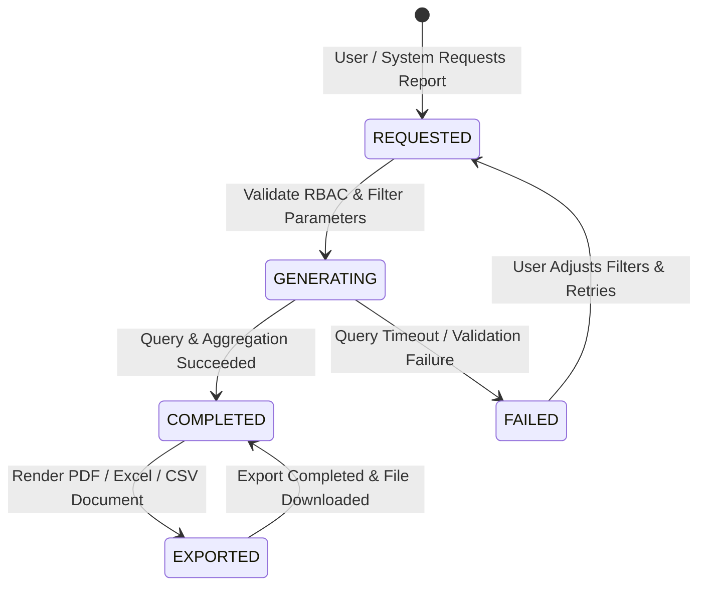

# Reports & Analytics User Flow & System Flow Specification — ClinicOS

## 1. Executive Summary & Flow Architecture

This document specifies the complete user interaction and system execution workflows for the **Reports & Analytics Module (Module-012)**. The workflow architecture coordinates real-time executive dashboard metric rendering, multi-criteria report generation, financial summary computations, doctor performance tracking, anonymized clinical aggregations, document exports (PDF, Excel, CSV), and offline SQLite reporting with post-reconnection cloud synchronization.

All workflows enforce the **Platform Owner Isolation Barrier (`PLATFORM_ADMIN_REPORTS_RESTRICTED`)**, strictly preventing Platform Owners (`SUPER_ADMIN` under `tenantId: "PLATFORM"`) from accessing clinic operational, financial, or patient analytical reports.

---

## 2. Report State Machine & Lifecycle

### 2.1 Mermaid State Diagram


### 2.2 Legal State Transition Table

| Current State | Target State | Trigger Event | Guard / Authorization Constraint | Action / Result |
| --- | --- | --- | --- | --- |
| **NONE** | `REQUESTED` | User clicks report title or dashboard tab | Active JWT session; RBAC permission check passed | Initialize report parameter state |
| `REQUESTED` | `GENERATING` | User submits filter form or dashboard loads | Date range valid; `tenantId` & `clinicId` attached | Execute database query & metric aggregations |
| `GENERATING` | `COMPLETED` | Aggregation finishes successfully | Data formatted; PII stripped for medical reports | Render report view & data tables |
| `GENERATING` | `FAILED` | Query timeout, invalid filters, or DB error | Exception caught | Display error banner & retry controls |
| `COMPLETED` | `EXPORTED` | User clicks "Export PDF / Excel / CSV" | Export permission check passed | Render file with metadata header & log audit |
| `EXPORTED` | `COMPLETED` | File download finishes | Download complete | Return UI to read-only view state |

---

## 3. Core Interaction & System Execution Flows

### 3.1 Flow 1: Dashboard Analytics & KPI Cards Execution Flow

```
[User Navigates to Dashboard]
              │
              ▼
[Authenticate JWT & Scoping]
  ├─ If SUPER_ADMIN ➔ Render Platform Infrastructure Metrics Only (tenantId: "PLATFORM")
  └─ If Clinic User ➔ Attach tenantId & clinicId Filter
              │
              ▼
[Fetch Dashboard Widgets Parallel Promises]
  ├─ Promise 1: Today's Patients (Unique Check-Ins & Consultations)
  ├─ Promise 2: Today's Appointments (Scheduled, Completed, Waiting, Canceled)
  ├─ Promise 3: Revenue Today (Sum of COMPLETED visits)
  ├─ Promise 4: Expenses Today (Sum of PAID operating expenses)
  ├─ Promise 5: Outstanding Doctor Settlements (Unsettled balance pool)
  ├─ Promise 6: Active Doctors On Duty (Logins with active shifts)
  └─ Promise 7: Pending Notifications / Unacknowledged Critical Alerts
              │
              ▼
[Render KPI Cards, Charts & Activity Feed]
```

### 3.2 Flow 2: Standard Report Generation Workflow

```
[User Selects Report from Navigation Roster]
              │
              ▼
[RBAC Permission Verification]
  ├─ DENIED ➔ Render HTTP 403 Forbidden Screen (RF-001)
  └─ APPROVED ➔ Render Report Filter Bar
              │
              ▼
[User Configures Filter Parameters]
  (Date Range, Selected Doctor, Category, Status, Age/Gender Cohorts)
              │
              ▼
[Validate Filter Input Pipeline]
  ├─ If Invalid Date Range ➔ Show Validation Error (RF-002)
  └─ If Valid ➔ Transition State to GENERATING
              │
              ▼
[Execute Aggregation & Query Service]
  ├─ If Offline ➔ Query Local SQLite Database & Display Offline Banner
  └─ If Online ➔ Query Cloud API Gateway
              │
              ▼
[Check Result Payload]
  ├─ If 0 Records ➔ Render Empty State Component (RF-003)
  └─ If Records Found ➔ Transition State to COMPLETED & Render Data Table
```

### 3.3 Flow 3: Financial & Profit/Loss Calculation Workflow

```
[User Opens Financial Reports View]
              │
              ▼
[Select Reporting Window (Monthly / Quarterly / Annual)]
              │
              ▼
[Calculate Gross Revenue Engine]
  └─ Query appointments WHERE tenantId = X AND status = "COMPLETED" AND date inside range
              │
              ▼
[Calculate Operating Expenses Engine]
  └─ Query expenses WHERE tenantId = X AND status = "PAID" AND paymentDate inside range
              │
              ▼
[Calculate Net Profit & Cash Flow]
  ├─ Gross Revenue = Sum(Completed Appointments)
  ├─ Operating Expenses = Sum(Paid Expenses)
  └─ Net Operating Profit = Gross Revenue - Operating Expenses
              │
              ▼
[Render Read-Only Profit & Loss Financial Statement]
```

### 3.4 Flow 4: Doctor Performance Tracking Flow

```
[User Selects Doctor Performance Report]
              │
              ▼
[Select Doctor & Date Range]
  ├─ If Role == DOCTOR ➔ Lock Doctor Select to req.user.id (Self-Service)
  └─ If Role == CLINIC_MANAGER ➔ Enable Doctor Dropdown Select
              │
              ▼
[Compute Practitioner Metrics]
  ├─ Completed Visit Count = Sum(Appointments WHERE status == "COMPLETED")
  ├─ No-Show / Cancellation Ratio = (NoShows + Canceled) / Total Scheduled
  ├─ Total Revenue Generated = Sum(Completed Visit Fees)
  └─ Completion Rate = (Completed Visits / Total Scheduled Visits) * 100
              │
              ▼
[Render Doctor Productivity & Performance Summary]
```

### 3.5 Flow 5: Appointment Analytics Flow

```
[User Selects Appointment Analytics Report]
              │
              ▼
[Select Date Range & Specialty Filter]
              │
              ▼
[Aggregate Booking Densities]
  ├─ Calculate Total Scheduled, Completed, Canceled, Rescheduled, No-Show Volumes
  ├─ Calculate Peak Hourly Densities (8 AM - 8 PM)
  ├─ Compute Average Waiting Time (Check-In Time ➔ Consultation Start Time)
  └─ Compute Average Consultation Duration (Consultation Start ➔ Complete Time)
              │
              ▼
[Render Time-Series Charts & Efficiency Breakdown]
```

### 3.6 Flow 6: Patient Analytics & Demographics Flow

```
[User Selects Patient Analytics Report]
              │
              ▼
[Select Registration Date Range]
              │
              ▼
[Compute Acquisition & Demographics]
  ├─ Count New Registrations in Period
  ├─ Compute Returning vs New Patient Visit Ratio
  ├─ Group Patients by Age Cohorts (<18, 18-35, 36-50, 51-65, >65)
  └─ Calculate Gender Proportions (Male, Female, Other)
              │
              ▼
[Render Patient Acquisition & Demographic Charts]
```

### 3.7 Flow 7: Multi-Format Document Export Workflow

```
[User Clicks "Export Report" Button]
              │
              ▼
[Select Export Format (PDF / Excel / CSV)]
              │
              ▼
[Export Security Verification]
  ├─ Check Export Permission
  └─ Attach Export Metadata Header (Clinic Legal Name, Timestamp, User, Applied Filters)
              │
              ▼
[Document Rendering Engine]
  ├─ PDF ➔ Render Formatted Vector Document with Header & Tables
  ├─ Excel ➔ Format Multi-Sheet Spreadsheet (.xlsx)
  └─ CSV ➔ Format Raw Comma-Separated Data Values
              │
              ▼
[Log Governance Audit Entry]
  (Action: REPORT_EXPORT, User, ReportType, Format, Timestamp)
              │
              ▼
[Prompt Browser File Save / Download Stream]
```

### 3.8 Flow 8: Offline Reporting & Reconnection Synchronization Flow

```
[User Generates Report while Application is Offline]
              │
              ▼
[Query Local SQLite Database Engine]
              │
              ▼
[Render Report with Prominent Offline Banner]
  ("Offline Analytical View — Computed from Local SQLite Cache")
              │
              ▼
[Network Reconnection Detected]
              │
              ▼
[Background Database Sync Flush]
              │
              ▼
[Auto-Refresh Report Views]
  (Silent re-computation of active KPIs and data tables)
```

---

## 4. Role-Based Access Scoping Workflow Matrix

| User Role | Dashboard Access | Report Generation Scope | Export Capabilities |
| --- | --- | --- | --- |
| **Doctor** | Personal KPI Card | Self-Service Doctor Reports & Own Patients Only | PDF / Excel of Own Reports |
| **Receptionist** | Operational Queue KPI | Appointment Queue & Reception Workflow Reports Only | PDF / CSV of Daily Roster |
| **Accountant** | Financial Overview KPI | Gross Revenue, Operating Expenses, Net Profit, Cash Flow | Full PDF / Excel Financial Statements |
| **Clinic Manager** | Full Clinic Dashboard | All Operational, Clinical, Doctor & Financial Clinic Reports | Full Export Capabilities |
| **Clinic Owner** | Full Clinic Dashboard | All Operational, Clinical, Doctor & Financial Clinic Reports | Full Export Capabilities |
| **Super Admin** | Platform Infrastructure | Platform Health, Backup Jobs & Disconnection History Only | Platform Infrastructure Exports Only |

---

## 5. Exception Flow Catalog (Failure Paths)

| Code | Exception Scenario | Root Cause | System & User Handling |
| --- | --- | --- | --- |
| **RF-001** | Permission Denied | User role unauthorized for target report type | Display HTTP 403 error banner; log unauthorized access attempt. |
| **RF-002** | Invalid Date Range | `startDate` > `endDate` or range > 365 days | Display inline form validation error; disable generate button. |
| **RF-003** | Empty Search Results | No data matching filter criteria | Display EmptyState component with "Clear Filters" button. |
| **RF-004** | Large Dataset Timeout | Aggregation query exceeds 30-second execution limit | Abort query; render error banner suggesting narrower date range filter. |
| **RF-005** | Export Generation Failure | PDF/Excel rendering memory buffer overflow | Catch exception; render error toast with option to retry in CSV format. |
| **RF-006** | Platform Owner Barrier | `SUPER_ADMIN` attempts to view clinic operational reports | Block query (`PLATFORM_ADMIN_REPORTS_RESTRICTED`); log security alert. |
| **RF-007** | Offline Sync Conflict | Data modified locally while cloud sync is pending | Prioritize cloud authoritative finalized records upon reconnection. |
| **RF-008** | Database Connection Loss | Unexpected local database crash during query | Render error card; prompt user to restart application or refresh. |
| **RF-009** | Unsettled Settlement Alert | Financial report includes draft doctor settlements | Display warning pill: *"Unapproved draft settlements excluded from cash flow"*. |
| **RF-010** | Concurrent Export Lock | User triggers duplicate export requests rapidly | Debounce export button; disable control during active generation. |

---

## 6. Reserved Future Extension Workflows (V2)

1. **AI Predictive Revenue & No-Show Analytics Workflow**: Machine learning model evaluates historical appointment and cancellation patterns to forecast next-month clinic revenue and patient no-show probabilities.
2. **Automated Scheduled Email Digest Workflow**: Cron scheduler generates PDF financial and operational digests on Sunday midnight and emails them directly to Clinic Owners.
3. **Interactive Graph Node Drilling Workflow**: Clicking a node in a revenue or volume time-series graph directly navigates the user to the source Appointment or Expense details drawer.

---

## 7. Quality Assurance & Verification Checklist

- [x] Mermaid state machine and legal state transition table completed.
- [x] 8 detailed user interaction & system execution flows specified.
- [x] Platform Owner isolation barrier (`PLATFORM_ADMIN_REPORTS_RESTRICTED`) integrated into all flows.
- [x] Financial revenue (`COMPLETED` visits) and expense (`PAID` status) rules enforced in flow logic.
- [x] RBAC permission matrix and data scoping defined across 6 roles.
- [x] 10 exception failure paths (RF-001 through RF-010) cataloged.
- [x] Document export workflow (PDF, Excel, CSV) with governance audit logging specified.
- [x] Offline SQLite reporting and auto-refresh flow detailed.
- [x] CHANGELOG.md updated with TASK-111 entry.
