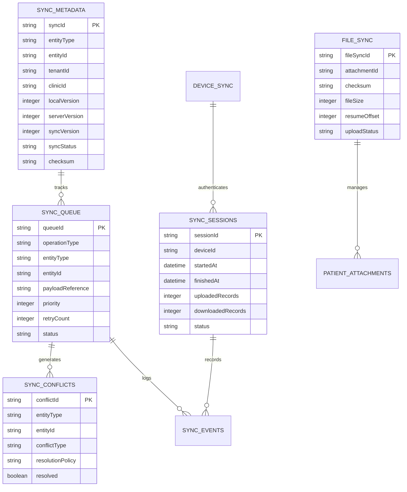

# Desktop Offline Synchronization Engine Database & Metadata Architecture

## Module Overview

This document specifies the complete database schema design, synchronization metadata structures, version vector tracking, sequence numbering, transaction boundaries, and indexing strategies for the **Desktop Offline Synchronization Engine** (Module-018).

The architecture uses a **Decoupled Offline-First Hybrid Database Strategy**:
- **Clean Business Collections**: Local SQLite and Cloud MongoDB business collections (`patients`, `appointments`, `medical_records`, `prescriptions`, `patient_attachments`) remain clean without sync logic pollution.
- **Centralized Sync Metadata Store**: Separate local SQLite tables and remote MongoDB BSON collections dedicated exclusively to tracking synchronization queues, version vectors, conflict logs, and device session metadata.

---

## Entity-Relationship & Metadata Architecture



---

## Remote MongoDB BSON Master Collections

In the cloud master environment, synchronization metadata is maintained in dedicated MongoDB collections isolated from business collections:

### 1. `sync_metadata` (Centralized Entity Sync Trackers)
```json
{
  "_id": "sm_908123",
  "syncId": "sm_908123",
  "entityType": "PATIENT",
  "entityId": "pat_101",
  "tenantId": "tenant-default",
  "clinicId": "clinic-default",
  "localVersion": 3,
  "serverVersion": 3,
  "syncVersion": 15,
  "syncStatus": "SYNCED",
  "lastSyncedAt": "2026-08-02T19:30:00.000Z",
  "lastModifiedAt": "2026-08-02T19:28:12.000Z",
  "lastModifiedBy": "usr_doc_01",
  "checksum": "e3b0c44298fc1c149afbf4c8996fb92427ae41e4649b934ca495991b7852b855",
  "deleted": false,
  "archived": false
}
```

### 2. `sync_queue` (Pending Operations Queue)
```json
{
  "_id": "sq_441209",
  "queueId": "sq_441209",
  "operationType": "UPDATE",
  "entityType": "MEDICAL_RECORD",
  "entityId": "rec_8812",
  "tenantId": "tenant-default",
  "clinicId": "clinic-default",
  "priority": 2,
  "payloadReference": "s3://sync-payloads/tenant-default/sq_441209.json",
  "retryCount": 0,
  "maxRetries": 10,
  "status": "WAITING",
  "createdAt": "2026-08-02T19:31:00.000Z",
  "updatedAt": "2026-08-02T19:31:00.000Z",
  "nextRetryAt": null,
  "lastError": null
}
```

### 3. `sync_sessions` (Synchronization Execution Logs)
```json
{
  "_id": "ss_772101",
  "sessionId": "ss_772101",
  "tenantId": "tenant-default",
  "clinicId": "clinic-default",
  "deviceId": "dev_pc_doctor_01",
  "startedAt": "2026-08-02T19:30:00.000Z",
  "finishedAt": "2026-08-02T19:30:02.150Z",
  "status": "COMPLETED",
  "uploadedRecords": 4,
  "downloadedRecords": 1,
  "conflicts": 0,
  "failures": 0,
  "durationMs": 2150
}
```

### 4. `sync_conflicts` (Unresolved & Audit Conflict Records)
```json
{
  "_id": "sc_110293",
  "conflictId": "sc_110293",
  "entityType": "APPOINTMENT",
  "entityId": "app_9912",
  "tenantId": "tenant-default",
  "clinicId": "clinic-default",
  "localVersion": 2,
  "serverVersion": 3,
  "conflictType": "VERSION_DIVERGENCE",
  "resolutionPolicy": "SERVER_WINS",
  "resolved": true,
  "resolvedBy": "SYSTEM_POLICY",
  "resolvedAt": "2026-08-02T19:30:01.000Z",
  "createdAt": "2026-08-02T19:30:01.000Z"
}
```

### 5. `sync_events` (Historical Synchronization Telemetry Event Log)
```json
{
  "_id": "se_883012",
  "eventId": "se_883012",
  "sessionId": "ss_772101",
  "entityType": "PATIENT",
  "entityId": "pat_101",
  "eventType": "MUTATION_APPLIED",
  "timestamp": "2026-08-02T19:30:01.500Z",
  "result": "SUCCESS",
  "durationMs": 42,
  "details": "Delta patch applied cleanly; local version updated to 3"
}
```

### 6. `file_sync` (Attachment Transfer Metadata & Resume Offsets)
```json
{
  "_id": "fs_339102",
  "fileSyncId": "fs_339102",
  "attachmentId": "att_xray_042",
  "tenantId": "tenant-default",
  "clinicId": "clinic-default",
  "uploadStatus": "UPLOADING",
  "downloadStatus": "IDLE",
  "checksum": "a8f5f167f44f4964e6c998dee827110c",
  "binaryVersion": 1,
  "storageProvider": "LOCAL_S3",
  "fileSize": 26214400,
  "lastTransfer": "2026-08-02T19:31:30.000Z",
  "resumeOffset": 15728640
}
```

### 7. `device_sync` (Registered Desktop Client Registry)
```json
{
  "_id": "dev_pc_doctor_01",
  "deviceId": "dev_pc_doctor_01",
  "tenantId": "tenant-default",
  "clinicId": "clinic-default",
  "deviceName": "Dr. Mansoor PC (Clinic Room 1)",
  "syncEnabled": true,
  "lastSeen": "2026-08-02T19:31:30.000Z",
  "lastSuccessfulSync": "2026-08-02T19:30:02.000Z",
  "applicationVersion": "1.0.0",
  "databaseVersion": "1.0",
  "synchronizationVersion": "1"
}
```

### 8. `sync_config` (Clinic Multi-Tenant Sync Configuration)
```json
{
  "_id": "cfg_tenant_default",
  "tenantId": "tenant-default",
  "clinicId": "clinic-default",
  "automaticSync": true,
  "syncIntervalSeconds": 60,
  "retryLimit": 10,
  "conflictPolicy": "ENTITY_DEFAULT",
  "bandwidthLimitKbps": 10240,
  "syncAttachments": true,
  "syncReports": true,
  "syncNotifications": true,
  "updatedAt": "2026-08-02T19:00:00.000Z"
}
```

---

## Local Embedded SQLite Metadata Schema

For desktop offline operation, SQLite mirrors these data structures using optimized, lightweight tables:

```sql
CREATE TABLE sync_queue (
    queue_id TEXT PRIMARY KEY NOT NULL,
    tenant_id TEXT NOT NULL,
    clinic_id TEXT NOT NULL,
    entity_type TEXT NOT NULL,
    entity_id TEXT NOT NULL,
    operation_type TEXT NOT NULL,
    payload_json TEXT NOT NULL,
    status TEXT NOT NULL DEFAULT 'WAITING',
    retry_count INTEGER NOT NULL DEFAULT 0,
    max_retries INTEGER NOT NULL DEFAULT 10,
    next_retry_at DATETIME,
    error_message TEXT,
    priority INTEGER NOT NULL DEFAULT 2,
    created_at DATETIME NOT NULL DEFAULT CURRENT_TIMESTAMP,
    updated_at DATETIME NOT NULL DEFAULT CURRENT_TIMESTAMP
);

CREATE TABLE sync_state (
    entity_type TEXT PRIMARY KEY NOT NULL,
    tenant_id TEXT NOT NULL,
    clinic_id TEXT NOT NULL,
    last_synced_version INTEGER NOT NULL DEFAULT 0,
    last_synced_at DATETIME,
    server_sequence_token TEXT,
    checksum_hash TEXT,
    updated_at DATETIME NOT NULL DEFAULT CURRENT_TIMESTAMP
);

CREATE TABLE sync_conflicts (
    conflict_id TEXT PRIMARY KEY NOT NULL,
    tenant_id TEXT NOT NULL,
    clinic_id TEXT NOT NULL,
    queue_id TEXT,
    entity_type TEXT NOT NULL,
    entity_id TEXT NOT NULL,
    local_version_json TEXT NOT NULL,
    remote_version_json TEXT NOT NULL,
    conflict_policy_applied TEXT NOT NULL,
    resolution_status TEXT NOT NULL DEFAULT 'AUTO_RESOLVED',
    resolved_by_user_id TEXT,
    resolved_at DATETIME,
    created_at DATETIME NOT NULL DEFAULT CURRENT_TIMESTAMP
);

CREATE TABLE file_sync_chunks (
    chunk_id TEXT PRIMARY KEY NOT NULL,
    attachment_id TEXT NOT NULL,
    chunk_index INTEGER NOT NULL,
    total_chunks INTEGER NOT NULL,
    chunk_size_bytes INTEGER NOT NULL,
    sha256_checksum TEXT NOT NULL,
    status TEXT NOT NULL DEFAULT 'PENDING',
    uploaded_at DATETIME,
    created_at DATETIME NOT NULL DEFAULT CURRENT_TIMESTAMP,
    UNIQUE(attachment_id, chunk_index)
);

CREATE TABLE sync_audit_log (
    log_id TEXT PRIMARY KEY NOT NULL,
    tenant_id TEXT NOT NULL,
    clinic_id TEXT NOT NULL,
    device_id TEXT NOT NULL,
    event_type TEXT NOT NULL,
    entity_type TEXT,
    record_count INTEGER NOT NULL DEFAULT 0,
    duration_ms INTEGER NOT NULL DEFAULT 0,
    event_hash TEXT NOT NULL,
    created_at DATETIME NOT NULL DEFAULT CURRENT_TIMESTAMP
);
```

---

## Decoupled Entity Tracking Extensions

Every synchronizable business table in local SQLite is augmented with standard sync tracking columns without polluting business logic:

```sql
ALTER TABLE patients ADD COLUMN sync_version INTEGER NOT NULL DEFAULT 1;
ALTER TABLE patients ADD COLUMN sync_status TEXT NOT NULL DEFAULT 'SYNCED';
ALTER TABLE patients ADD COLUMN last_synced_at DATETIME;
ALTER TABLE patients ADD COLUMN server_id TEXT;
```

---

## Four-Tier Version Strategy

Each entity tracks four version indicators:
1. **Business Version (`version`)**: Incremented on every user update.
2. **Sync Version (`syncVersion`)**: Incremented on cloud gateway acknowledgment.
3. **Server Version (`serverVersion`)**: Monotonic sequence counter on cloud master.
4. **SHA-256 Checksum (`checksum`)**: Hash of entity attributes for fast integrity check.

---

## Indexing Strategy

- **`sync_queue` Index**: Compound covered index `(status, priority, created_at)` for high-speed queue retrieval.
- **`sync_metadata` Index**: Compound index `(tenantId, clinicId, entityType, entityId)` unique constraint.
- **`file_sync` Index**: Index on `(attachmentId, uploadStatus)`.
- **`device_sync` Index**: Unique index on `(tenantId, deviceId)`.

---

## Future Architecture Extensions

- **Multi-Device Local Mesh Sync**: P2P SQLite synchronization across local desktop nodes on the same LAN without cloud round-trip.
- **WebSocket Synchronization Stream**: Persistent real-time change stream push via WebSocket connections.
- **Mobile Client Sync Storage**: Lightweight BSON synchronization schema for mobile tablet applications.
