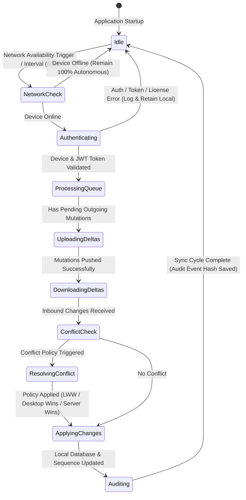

# Desktop Offline Synchronization Engine User Flow Design

## Module Overview

This document specifies the complete user flow design, state machine transitions, queue state lifecycle, conflict handling, and error recovery protocols for the **Desktop Offline Synchronization Engine** (Module-018).

The user experience is designed around a transparent **Offline-First Paradigm** where clinic staff work without UI freezes or synchronization prompts during normal operations. Synchronization executes asynchronously in background threads, updating the status bar non-intrusively.

---

## Synchronization Lifecycle State Machine



---

## Connectivity States & Transition Matrix

| State Name | Trigger | Active Behavior | UI Status Bar Badge |
| --- | --- | --- | --- |
| **Offline** | Ping failure / No network interface | 100% local operation; sync paused | `Offline Mode (Local Storage Only)` |
| **Connecting** | Network interface detected | Pings cloud sync gateway | `Checking Connection...` |
| **Authenticating**| Gateway responded | Validates device certificate & JWT | `Authenticating Device...` |
| **Synchronizing** | Authentication success | Processing outgoing/incoming deltas | `Syncing Changes (3 pending)...` |
| **Idle** | Sync cycle completed | Listening for local edits / timer | `Synced — All Records Up-to-Date` |
| **Retry** | Transient network timeout | Exponential backoff timer active | `Connection Lost — Retrying in 15s...` |
| **Conflict** | Manual conflict policy hit | Notifies authorized clinic manager | `Sync Conflict — Review Required` |
| **Error** | Critical credential / license error | Pauses sync & logs error | `Sync Error — Invalid Device Auth` |

---

## Queue States Lifecycle

Every queued mutation object passes through the following state machine:

1. **`Waiting`**: Mutation enqueued in local SQLite `sync_queue` table awaiting sync cycle.
2. **`Uploading`**: Payload currently being transmitted to cloud gateway.
3. **`Downloading`**: Processing incoming server deltas for local entity.
4. **`Synced`**: Server acknowledged mutation receipt and returned sequence token.
5. **`Retry Pending`**: Transient network error; waiting for exponential backoff timer.
6. **`Conflict`**: Manual resolution required by clinic owner.
7. **`Failed`**: Max retries (10) exceeded or permanent payload rejection.
8. **`Cancelled`**: Superseded by subsequent local update.

---

## Detailed Core User Workflows

### 1. Application Startup Flow
```
Application Starts
├── 1. Load Local SQLite Database
├── 2. Verify Local Database Integrity & Schema Version
├── 3. Render Clinic Dashboard Immediately (Zero Loading Delays)
└── 4. Asynchronously Check Internet Connectivity
    ├── IF OFFLINE: Continue local desktop operation uninterrupted
    └── IF ONLINE: Trigger Background Device Authentication & Sync Worker
```

### 2. Background Synchronization Flow
```
Background Sync Worker (Timer / Local Event)
├── 1. Read Pending Queue Items from `sync_queue` Table
├── 2. Validate Active JWT Token & Device Authentication Certificate
├── 3. Package Outgoing Operations into Compressed JSON Delta Batch
├── 4. POST Delta Batch to Cloud Sync Endpoint
├── 5. Receive Server Acknowledgment & Sequence Commit Tokens
├── 6. Fetch Incoming Server Changes (version > lastSyncedVersion)
├── 7. Apply Server Changes to Local SQLite Database
├── 8. Update Local Sync Tracking Table (`sync_status = 'SYNCED'`)
└── 9. Dispatch Non-Blocking Audit Log Event
```

### 3. Manual Synchronization Flow
```
User Clicks "Sync Now" Button
├── 1. Check Network Connectivity
│   └── IF OFFLINE: Display Toast "No Internet Connection — Operations Stored Locally"
├── 2. Show Animated Spinner on Status Bar ("Synchronizing...")
├── 3. Execute Immediate Flush of Outgoing `sync_queue`
├── 4. Fetch Latest Remote Incremental Deltas
├── 5. Update Status Bar: "Synchronization Complete — 12 Records Updated"
└── 6. Auto-Hide Toast after 3 seconds
```

### 4. Initial Device Bootstrap Synchronization Flow
```
First Desktop Login on New Clinic PC
├── 1. Authenticate Staff Member Credentials & License Key
├── 2. Register Device Fingerprint & Request Device Certificate
├── 3. Download Full Clinic Dataset (Initial Bootstrap Snapshot)
├── 4. Populate Local SQLite Database Tables & Build FTS5 Indexes
├── 5. Verify Record Counts & Cryptographic Hash Validation
└── 6. Set Desktop State to "Ready & Synchronized"
```

### 5. Incremental Delta Synchronization Flow
```
Local Record Modified (e.g. Patient Phone Number Updated)
├── 1. Write Record to Local SQLite Table (`version = version + 1`)
├── 2. Insert Operation Record into `sync_queue` (`status = 'WAITING'`)
├── 3. Background Worker Extracts Modified Attributes Only (Delta Patch)
├── 4. Transmit Delta Patch to Server Endpoint
├── 5. Server Applies Patch & Returns Updated `syncVersion`
└── 6. Local Database Updates `syncStatus = 'SYNCED'` & Stores `syncVersion`
```

### 6. Conflict Detection & Automated Policy Resolution Flow
```
Incoming Server Record Version Received
├── 1. Compare Server Record `version` with Local Record `version`
├── 2. Check if Local Record has Unsynced Pending Changes (`syncStatus == 'PENDING'`)
├── 3. IF NO CONFLICT: Apply Server Record Update to Local SQLite Table
└── 4. IF CONFLICT ENCOUNTERED:
    ├── Consult Entity Conflict Resolution Matrix:
    │   ├── PATIENTS: Last Write Wins (LWW) -> Apply Latest `updatedAt` Timestamp
    │   ├── MEDICAL RECORDS: Desktop Wins -> Retain Local Point-of-Care Record
    │   ├── PRESCRIPTIONS: Desktop Wins -> Retain Physician Prescribed Record
    │   └── CLINIC SETTINGS: Server Wins -> Overwrite Local Settings
    ├── Record Audit Log Event `SYNC_CONFLICT_RESOLVED`
    └── Continue Queue Processing
```

### 7. Manual Conflict Resolution Flow
```
Unresolvable Conflict Detected (e.g. Double Appointment Booking)
├── 1. Mark Record in `sync_queue` as `status = 'CONFLICT'`
├── 2. Display Warning Badge on Sync Status Bar ("1 Conflict Needs Attention")
├── 3. Authorized Staff Member Opens "Sync Conflict Resolution" Modal
├── 4. Modal Displays Side-by-Side Comparison:
│   ├── Local Version (Desktop Record)
│   └── Remote Version (Cloud / Online Portal Record)
├── 5. Staff Member Clicks "Keep Local Version" OR "Use Remote Version"
├── 6. Selected Version Applied to Database & Re-Enqueued in `sync_queue`
└── 7. Sync Resumes Normal Background Execution
```

### 8. Resumable File Attachment Synchronization Flow
```
New Patient Attachment Uploaded on Desktop (e.g. 25MB X-Ray Image)
├── 1. Save Attachment File to Local Desktop Disk (`/storage/attachments/`)
├── 2. Save Metadata Record to Local SQLite Database (`syncStatus = 'PENDING'`)
├── 3. Push File Metadata Record via Standard JSON Delta Sync
├── 4. Initiate Chunked Resumable File Upload (5MB Chunks) via Multi-part API
├── 5. If Network Drops at Chunk 3 (15MB):
│   └── Retain Chunk State Log on Local Disk
├── 6. Network Restored -> Query Cloud Resumable Upload Status (Resume from Chunk 4)
└── 7. File Upload Complete -> Verify SHA-256 Checksum & Mark File `SYNCED`
```

### 9. Exponential Backoff Retry Flow
```
Sync Request Fails (e.g. HTTP 503 Server Unavailable or Network Drop)
├── 1. Increment Retry Counter for Operation (`retryCount = retryCount + 1`)
├── 2. Classify Failure Type:
│   ├── TEMPORARY (Network Drop, Server 503, Timeout):
│   │   ├── Calculate Backoff Interval: `min(5 * 2^(retryCount-1), 900)` Seconds + Jitter
│   │   ├── Set Queue Status: `RETRY_PENDING`
│   │   └── Schedule Retry Execution
│   └── PERMANENT (HTTP 400 Bad Request, Schema Mismatch):
│       ├── Set Queue Status: `FAILED`
│       ├── Flag Record for Manual Review
│       └── Log Critical Error Audit Event
```

### 10. Offline Network Recovery Flow
```
Internet Connection Restored after Extended Outage (e.g. 4 Hours Offline)
├── 1. Connectivity Detector Receives Network Available Event
├── 2. Transition Status Bar to `Connecting...`
├── 3. Validate Authentication Token & Device License Key
├── 4. Pause New Enqueues Momentarily to Order Pending Queue Operations
├── 5. Execute Sequential Flush of `sync_queue` Operations (FIFO Order)
├── 6. Fetch Missed Server Sequences (`sinceVersion = lastKnownSyncVersion`)
├── 7. Apply Server Updates and Clear Enqueued Queue Items
└── 8. Transition Status Bar to `Synced — All Records Up-to-Date`
```

---

## Error Flow Catalog (EF-001 to EF-011)

| Error Code | Error Description | Trigger Condition | Automated Graceful Recovery Path |
| --- | --- | --- | --- |
| **EF-001** | `AUTH_TOKEN_EXPIRED` | JWT bearer token expired during sync | Background token refresh via device refresh secret, then re-try sync. |
| **EF-002** | `DEVICE_NOT_REGISTERED` | Device ID unrecognized by cloud gateway | Pause sync; prompt Clinic Manager to re-authorize device in admin settings. |
| **EF-003** | `TENANT_SUSPENDED` | Account billing suspended on cloud master | Transition to local read-only mode for cloud sync; local editing remains active. |
| **EF-004** | `SERVER_UNAVAILABLE` | Cloud server HTTP 502/503/504 response | Exponential backoff retry (5s, 15s, 60s...) without disturbing desktop staff. |
| **EF-005** | `NETWORK_TIMEOUT` | TCP connection timeout > 15 seconds | Retain queue items in `RETRY_PENDING` state and re-check connection. |
| **EF-006** | `CORRUPTED_QUEUE_ITEM` | Unparseable JSON payload in queue item | Quarantine item to `sync_quarantine` table; continue processing remaining queue. |
| **EF-007** | `SEQUENCE_DIVERGENCE` | Local sync version integer out-of-sync | Trigger Incremental Recovery Sync to re-fetch sequence vector tokens. |
| **EF-008** | `SCHEMA_VERSION_MISMATCH` | Cloud API updated to newer DB schema | Display unobtrusive notification: "Desktop App Update Recommended". |
| **EF-009** | `FILE_UPLOAD_ABORTED` | Network dropped mid-chunk upload | Resume upload from last verified 5MB chunk offset upon reconnect. |
| **EF-010** | `CHECKSUM_MISMATCH` | SHA-256 hash validation failed on cloud | Re-calculate local binary checksum and re-transmit corrupted file chunk. |
| **EF-011** | `CONFLICT_UNRESOLVED` | Complex double-edit unable to auto-resolve | Flag record as `CONFLICT`; notify Clinic Admin for manual side-by-side review. |

---

## Future Extension Workflows (V2 Roadmap)

- **Multi-Device Local Mesh Sync Workflow**: Peer-to-peer (P2P) synchronization over local Wi-Fi/LAN between multiple desktop instances in the same clinic without requiring internet connectivity.
- **WebSocket Real-Time Push Workflow**: Persistent WebSocket connection receiving instant push events when patients book appointments via the Online Booking Portal.
- **Mobile Companion Sync Workflow**: Direct local synchronization with mobile tablet applications used by nurses for vital signs intake.
