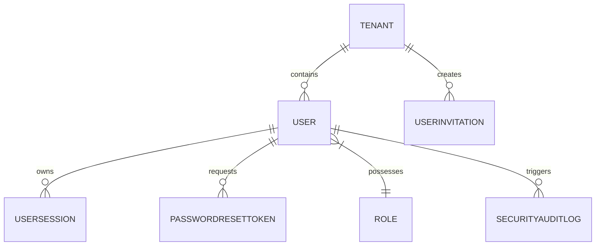
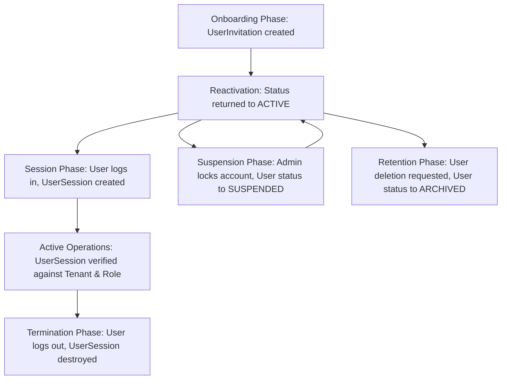

# Authentication Database Design (AUTHENTICATION_DATABASE.md)

This document defines the conceptual data model, business entities, relationships, ownership boundaries, and storage rules for the **Authentication Module** of ClinicOS.

---

## 1. Overview
The database layer for the Authentication Module is responsible for persisting user identities, active sessions, invitations, and access recovery tokens. Its primary architectural goals are enforcing referential integrity, supporting strict multi-tenant isolation, ensuring secure password hashing containment, and enabling detailed security auditing.

---

## 2. Business Entities
To support the authentication lifecycle, the system defines the following core business entities:
- **Tenant (Clinic)**: Represents an isolated clinic client workspace on the platform. It holds subscription states and metadata.
- **User (Account Profile)**: Represents an individual user identity. Holds names, email records, credential hash bindings, and suspension statuses.
- **Role (Authorization Group)**: Represents a set of system privileges. A User is assigned exactly one Role per Tenant context.
- **UserInvitation (Staff Invitation)**: Tracks pending registration invites sent to staff. Links to a specific Tenant and target Role.
- **PasswordResetToken (Recovery Link)**: Tracks active, time-limited tokens generated when a user requests a credential reset.
- **UserSession (Active Session)**: Tracks active login instances. Tied to a specific User and Tenant context.
- **SecurityAuditLog (Access Logs)**: Records security-relevant authentication events (failed logins, password modifications, token invalidations).

---

## 3. Entity Relationships
The conceptual relationships between these entities are structured below:

- A **Tenant** contains multiple **Users** and creates multiple **UserInvitations**.
- A **User** belongs to exactly one **Role** per Tenant scope.
- A **User** owns multiple active **UserSessions** (supporting multiple devices/tabs) and can request multiple **PasswordResetTokens** over time.
- A **User** triggers multiple **SecurityAuditLogs** for login and security events.

---

## 4. Authentication Data Lifecycle
Data associated with authentication flows through several conceptual phases:

---

## 5. Ownership Rules
- **Tenant Isolation**: Every `User`, `UserInvitation`, and `UserSession` must be explicitly owned by a single `Tenant`. All queries must filter by `Tenant ID` as the primary boundary.
- **User Identity Ownership**: Email records must be uniquely bound to a single active user profile across the database to prevent cross-account identity conflicts.
- **Session Lifecycles**: A `UserSession` record is owned by the `User` and must be deleted automatically when the user logs out or the session expires.

---

## 6. State Model & Transition Rules

| Initial State | Event | Transition Condition | Final State |
| :--- | :--- | :--- | :--- |
| `None` | Onboarding Invitation Sent | Link created with token | `INVITED` |
| `INVITED` | Registration Link Opened & Submitted | Password set and verified | `ACTIVE` |
| `INVITED` | Token Expiry Timeout | Exceeds 72 hours without activation | `EXPIRED` |
| `ACTIVE` | Security Violation / Suspension | Admin action in dashboard | `SUSPENDED` |
| `SUSPENDED` | Suspension Revocation | Admin action in dashboard | `ACTIVE` |
| `ACTIVE` / `SUSPENDED` | Account Deletion Request | User deletes account or clinic closes | `ARCHIVED` |

---

## 7. Session Data Strategy
- **Stateless Verification**: The primary API request validation relies on stateless JWT decoding.
- **Session Tracking Database Records**: The database persists active `UserSession` records solely to support remote session invalidation, auditing active login counts, and blacklisting compromised tokens.
- **Automated Cleanup**: The database must support automated record expiration (e.g. Time-To-Live indexes or cron purging) to remove expired session records after 8 hours of inactivity.

---

## 8. Password Strategy
- **Containment**: Plaintext passwords must never be stored.
- **Hashing**: All passwords must be hashed using a computationally expensive, salted hashing algorithm before database persistence.
- **Entropy**: Passwords must meet minimum complexity criteria (10+ characters, mixed case, alphanumeric, special characters) validated at the database interface layer.

---

## 9. Reset Password Strategy
- **Single-Use Enforcement**: `PasswordResetToken` records must contain a single-use verification token. Once used, the record status must immediately transition to `USED` and become ineligible for further updates.
- **Time Limits**: Records must be flagged with an expiration date exactly 1 hour from creation. Any reset attempt using a token where current time exceeds the expiration date must be rejected.

---

## 10. Account Activation Strategy
- **Secure Onboarding Link**: Staff onboardings generate a `UserInvitation` containing a cryptographically random token.
- **Transition Gate**: Saving the registration details converts the `UserInvitation` status to `ACCEPTED`, and inserts a new `User` record into the datastore.

---

## 11. Tenant Isolation
To guarantee absolute tenant data safety at the database tier:
- Every query accessing `User`, `UserSession`, or `UserInvitation` tables must include the `Tenant ID` context as a required query parameter.
- Cross-tenant queries are strictly forbidden, except in the Super Admin system console context.

---

## 12. Data Integrity Rules
- **Identity Uniqueness**: The system must enforce database-level uniqueness constraints on the email column.
- **Cascading Deletions**: If a `Tenant` is deleted, all related `UserSession`, `UserInvitation`, and `PasswordResetToken` records must be cascaded/deleted immediately.
- **Referential Consistency**: Users cannot be assigned a `Role` that does not exist in the permissions database.

---

## 13. Soft Delete Strategy
Healthcare regulations demand strict audit trails, preventing physical deletion of core identities:
- **Deletion Model**: Users are never physically deleted. Instead, the account record status is updated to `ARCHIVED`.
- **Anonymization**: Upon archiving, sensitive contact fields (phone number, email address) are overwritten with randomized hashes to comply with privacy rules (e.g., right to be forgotten) while preserving audit link integrity.

---

## 14. Audit Strategy
The database must capture the following access audit events:
- **Failed Login Attempts**: Record time, target email, IP address, and increment count.
- **Successful Logins**: Record time, user ID, tenant ID, and device metadata.
- **Password Modifications**: Record time, user ID, and action (change/reset).
- **Session Revocations**: Record time, session ID, and cause (logout/admin termination).

---

## 15. Security Considerations
- **Log Sanitation**: Database audit logs must exclude password hashes or raw token payloads to prevent credential theft via compromised logs.
- **Access Limits**: Database access credentials must limit write/read scopes to the backend application user role only.

---

## 16. Scalability Considerations
- **Stateless Tokens**: Verifying sessions through JWT prevents database reads on standard API requests, ensuring performance remains stable as active user counts scale.
- **Index Plan Conceptualization**: Future physical schemas must index target foreign key columns (e.g., `Tenant ID`, `Email`, `Token payload`) to keep query times flat.

---

## 17. Risks
- **Brute-Force Log Bloat**: Malicious script attacks sending millions of failed requests could bloat audit log tables.
  * *Mitigation*: Configure rate limit thresholds at the network layer to block requests before they hit the database logic.
- **Orphaned Tokens**: Users requesting multiple reset links could leave orphaned records.
  * *Mitigation*: Enforce a database constraint allowing only one active `PasswordResetToken` per user email at any given time.

---

## 18. Open Questions
1. **Global Admin Accounts**: Do Super Admins belong to a specific tenant clinic, or do they reside in a system-wide root tenant?
   - *Proposal*: Super Admins will belong to a special system-level Tenant ID (`SYSTEM_ROOT`), allowing them to query across tenant boundaries.
