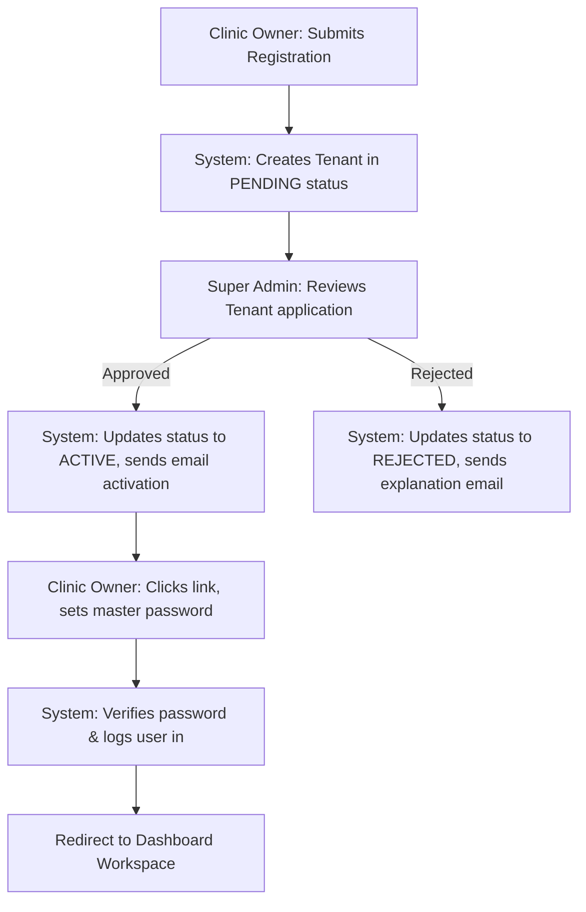
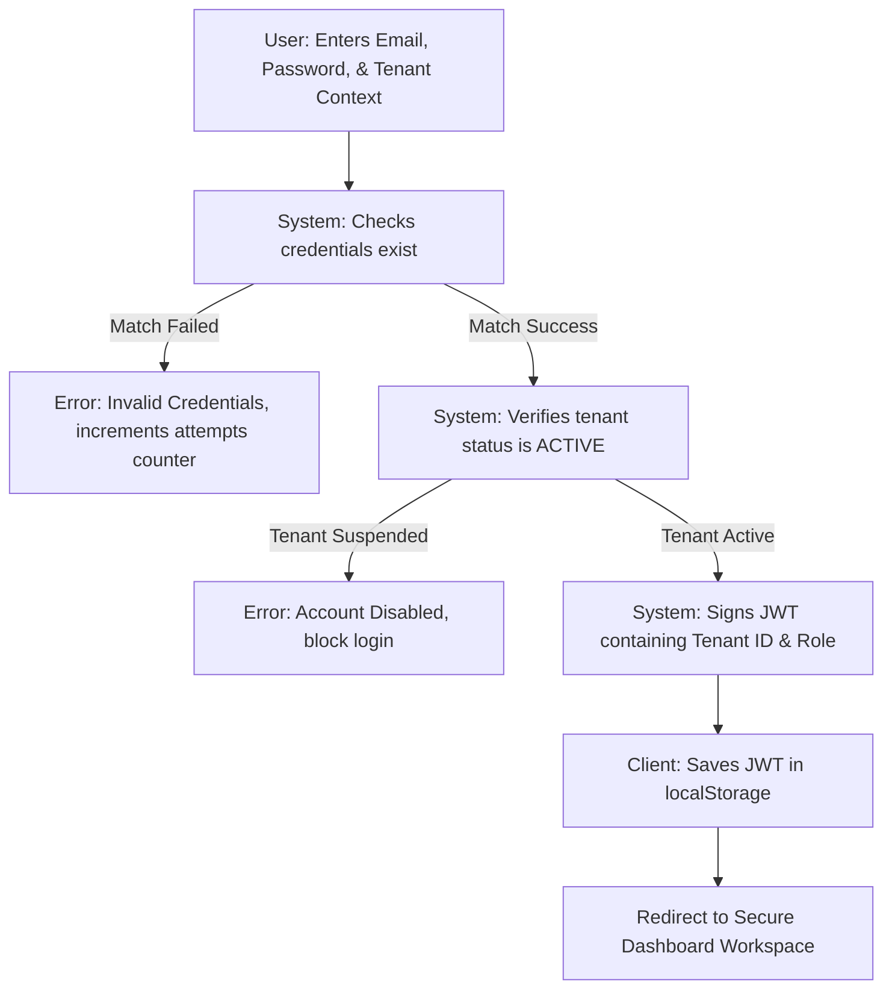
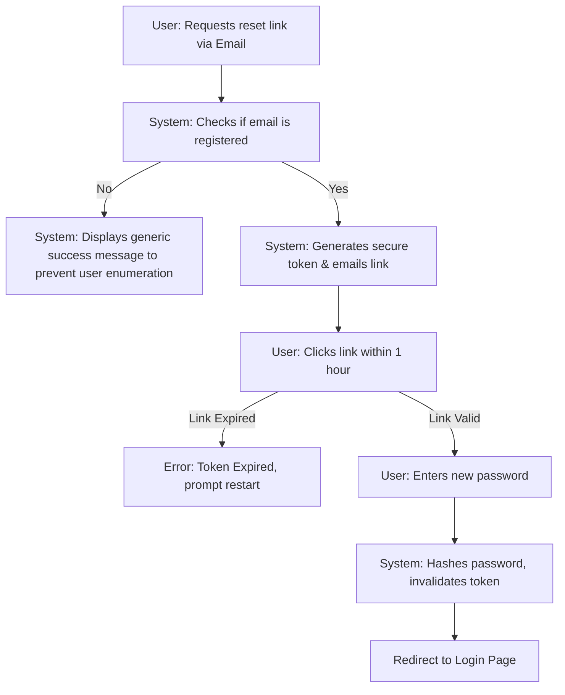
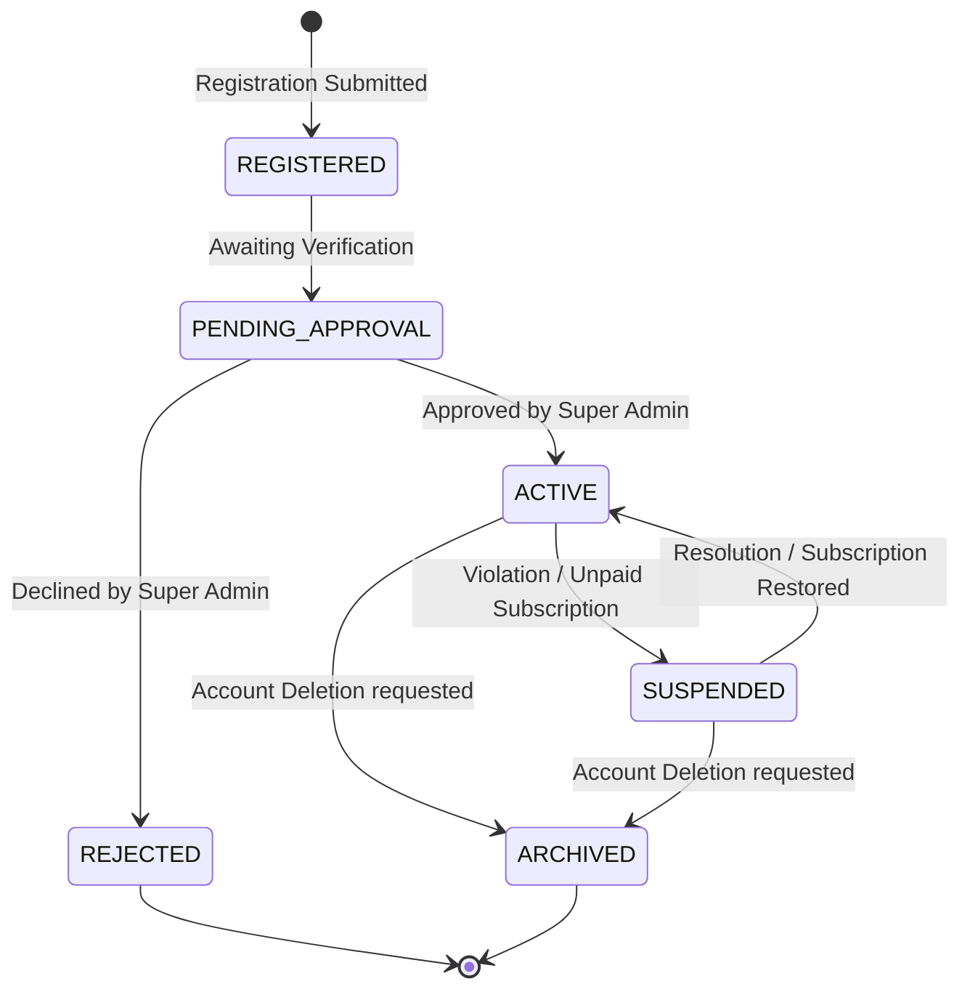

# Authentication User & System Flows (AUTHENTICATION_FLOW.md)

This document defines the interaction journeys, logical transitions, navigation paths, and edge cases for the **Authentication Module** of ClinicOS.

---

## 1. Module Overview
This document visualizes and outlines the sequential steps that actors and system services perform during login, onboarding registration, password resets, and session validation. It defines how data context (such as Tenant IDs) flows dynamically through checking layers to establish secure workspace sessions.

---

## 2. Actors & Responsibilities
- **Super Administrator (ClinicOS Platform Owner)**: Reviews registration applications, approves new tenants, and handles security suspensions.
- **Clinic Owner (Tenant Host)**: Initiates clinic registration, accesses the system after approval, and generates onboarding links.
- **Clinic Staff (Doctor, Nurse, Admin)**: Receives onboarding invitations, creates profile credentials, and logs in under their assigned clinic context.
- **Patient**: Performs login to access billing histories, consultation logs, and scheduling views.
- **System (ClinicOS Gatekeeper)**: Validates credentials, checks account suspension states, enforces tenant isolation scopes, and invalidates expired sessions.

---

## 3. Main User Flows

### Flow A: Clinic Registration to First Login
This flow maps the onboarding of a new clinic tenant into the system:

### Flow B: User Login & Session Creation
This flow details credential checking and tenant context extraction:

### Flow C: Forgot & Reset Password
This flow details the recovery of credentials:

### Flow D: Logout
- **Step 1**: User clicks "Logout" in topbar navigation.
- **Step 2**: Client application destroys JWT from localStorage.
- **Step 3**: Client notifies the server to blacklist/invalidate the active token identifier.
- **Step 4**: Redirect to `/auth/login` gateway page.

---

## 4. Alternate Flows

- **Wrong Password Flow**: System blocks access, warns the user, and records the attempt. On the 5th attempt, status switches to `LOCKED` for 15 minutes.
- **Expired Reset Link Flow**: User clicks an expired password-reset link. The page displays an expiration error message and provides a "Request New Link" button.
- **Pending Tenant Flow**: Owner attempts to log in before Super Admin approval. System displays: *"Your registration application is currently under review by our administration. You will be notified via email upon activation."*
- **Disabled Tenant/User Flow**: Staff attempts login on a suspended account. System displays: *"Access denied. Your account or your clinic workspace has been suspended. Please contact your administrator."*
- **Expired Session Flow**: Client makes an API request using an expired JWT. The server returns `401 Unauthorized` with error code `SESSION_EXPIRED`. The client clears the local token and redirects the user to the login page with a toast message: *"Session expired due to inactivity. Please log in again."*

---

## 5. Error Flows

- **Invalid Credentials**: Returns status code `401` with code `INVALID_CREDENTIALS`. User remains on `/auth/login`.
- **Missing Required Fields**: Front-end validation prevents submission. If bypassed, Backend returns `400 Bad Request` with code `VALIDATION_FAILED` detailing the missing input fields.
- **Locked Account**: Attempts to log in to a locked account within 15 minutes return `423 Locked` with code `ACCOUNT_LOCKED` indicating the remaining lockout time.
- **Server/Network Unavailable**: If API is unreachable, the client catches the connection error and renders an alert: *"Network connection lost. Please check your internet connection and try again."*

---

## 6. State Transitions
The system maintains the following state machine for user and tenant accounts:

---

## 7. Permission Scoping (RBAC Flow)
1. **Request Interception**: User initiates an action (e.g. Doctor clicking "Save EHR Record").
2. **Token Examination**: The system extracts the user's role (`Doctor`) from the decoded JWT payload.
3. **Policy Evaluation**: The system cross-references the request's resource/action against the permissions mapped to that role in the policy registry.
4. **Enforcement Gate**:
   - If permission exists, request is passed to the database controller.
   - If permission does not exist, backend returns `403 Forbidden` with code `FORBIDDEN_ACCESS`. The UI intercepts this and displays an access error banner.

---

## 8. Session Lifecycle
- **Creation**: Generated at successful login. Returns JWT with an expiration timestamp (`exp`) set to 8 hours from creation.
- **Validation**: Every backend request decodes the token signature to verify it has not expired and matches the requested `X-Tenant-ID`.
- **Expiration**: After 8 hours, the token signature automatically becomes invalid.
- **Renewal**: To prevent sudden logouts during active clinical consultations, the client refreshes the JWT in the background if the user interacts with the app within 30 minutes of token expiration.
- **Termination**: Triggered by user logout, browser cache clearance, or tenant suspension.

---

## 9. Navigation Redirection Map

| Initial State | Action | Target Destination |
| :--- | :--- | :--- |
| Unauthenticated user | Accesses `/dashboard/*` | Redirected to `/auth/login` |
| Authenticated user | Accesses `/auth/login` | Redirected to `/dashboard` |
| Pending activation link | Clicked link | `/auth/activate?token=...` |
| Successful login | Password verified | `/dashboard` |
| Successful logout | Button clicked | `/auth/login` |

---

## 10. Edge Cases

- **Refresh During Login Process**: If a user refreshes the page while the authentication request is processing, the request is cancelled. The client returns to the initial input state, allowing the user to click login again.
- **Browser Back Button**: If a logged-out user clicks the back button, the client routing checks localStorage. Finding no active token, it redirects the user back to `/auth/login`, preventing access to cached pages.
- **Multiple Tabs**: If a user logs out in Tab A, Tab B's next API request will return a `401` error, triggering Tab B to clear local storage and redirect to the login page immediately.
- **Network Interruption during JWT validation**: If a network drop occurs during token validation, the client displays a banner: *"Working Offline. Some data may not sync."* without immediately logging the user out, preserving typed text.

---

## 11. UX Considerations
- **Visual Feedback**: The login button transitions to a loading state (e.g. Spinner) and is disabled during authentication to prevent duplicate submissions.
- **Informative Error Context**: Error messages must not disclose system secrets (e.g. show *"Invalid email or password"* rather than *"Password incorrect"* to prevent account enumeration).
- **Inline Validation**: Form inputs show error validation markers (e.g. red border-line, helper message below input) when focus is lost rather than waiting for submission.
- **Session Warning Toast**: Displays warning popup 5 minutes before automatic timeout, offering an "Extend Session" action button.

---

## 12. Open Questions
1. **Inactive Session Period**: Should the 8-hour session expiration be strictly absolute, or should it extend dynamically on every API transaction?
   - *Proposal*: V1 will use absolute 8-hour expiration to comply with healthcare HIPAA guidelines, requiring re-login at the end of the shift.
