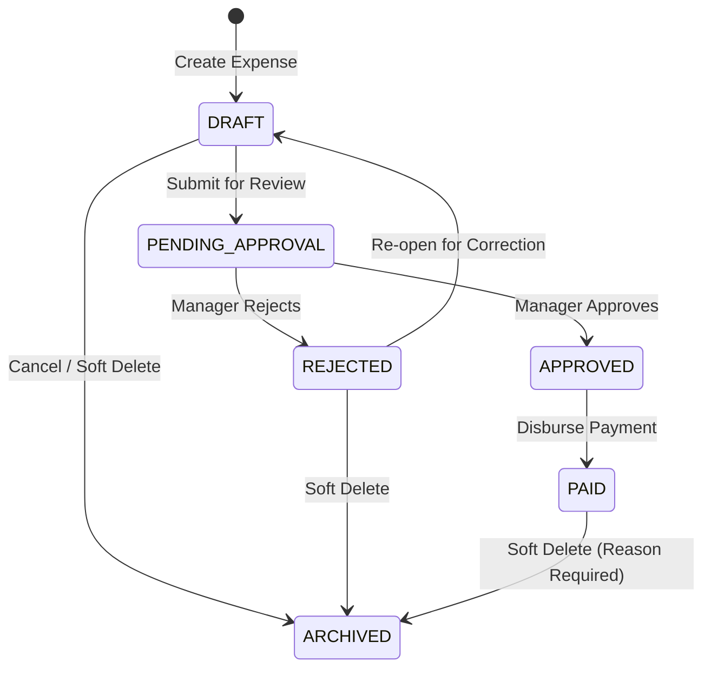

# Expenses Management Module Requirements Analysis (EXPENSES_MANAGEMENT.md)

This document establishes the official business, functional, architectural, and financial requirements for the **Expenses Management Module** (Module-009) of ClinicOS. It serves as the authoritative blueprint for database schemas, REST APIs, user flows, UI/UX designs, and integration engines.

---

## 1. Executive Summary & Business Goals

### Overview
The **Expenses Management Module** is the core operational expense tracking and financial foundation of ClinicOS. It enables clinics—ranging from solo practitioner offices to multi-branch medical centers—to record, classify, approve, track, and analyze all clinic overhead costs and operating expenses.

### Strategic Business Goals
1. **Accurate Operating Expense Tracking**: Provide a structured, audit-proof system for logging all clinic expenditures (utilities, medical supplies, staff salaries, rent, maintenance, marketing, taxes).
2. **Profitability Recognition**: Supply accurate expenditure metrics to calculate Clinic Net Profit & Loss (P&L = Gross Revenue - Recognized Paid Expenses).
3. **Operational Financial Controls**: Prevent unauthorized or unapproved expenditures by enforcing multi-step approval workflows (`DRAFT` ➔ `PENDING_APPROVAL` ➔ `APPROVED` ➔ `PAID`).
4. **Tenant Data Privacy**: Enforce strict SaaS financial privacy barriers preventing Platform Owners and unauthorized personnel from viewing private clinic accounting records.
5. **Future ERP Integration**: Reserve clean architectural boundaries for automated OCR receipt scanning, recurring expense automation, bank reconciliation, payroll processing, and tax engines.

---

## 2. Dynamic & Configurable Expense Categories

Operating expense categories must **NEVER** be hardcoded into system source code. Every tenant clinic must have full autonomy to define, customize, update, and manage its own expense classification hierarchy.

### Standard Preset Categories (Tenant Initial Seed)
When a new clinic workspace is provisioned, ClinicOS initializes the workspace with the following standard preset categories:

| Category Code | Category Name | Default Tax Status | Description |
| --- | --- | --- | --- |
| `CAT-RENT` | Facility Rent & Lease | Tax Deductible | Monthly building lease, booth rental, or facility space costs |
| `CAT-SALARIES` | Staff Salaries & Wages | Tax Deductible | Payroll compensation for doctors, nurses, receptionists, and staff |
| `CAT-UTILITIES` | Utilities (Electric, Water, Gas) | Tax Deductible | Electricity, water, natural gas, municipal utility bills |
| `CAT-COMM` | Telecom & Internet | Tax Deductible | Broadband internet, landline phone, mobile clinic lines, cloud server hosting |
| `CAT-MEDSUP` | Medical & Pharmaceutical Supplies | Tax Deductible | Syringes, gloves, PPE, antiseptic, bandages, diagnostic kits |
| `CAT-OFFSUP` | Office & Administrative Supplies | Tax Deductible | Paper, printing toner, stationery, prescription pads, filing supplies |
| `CAT-MAINT` | Equipment Maintenance & Repair | Tax Deductible | Servicing autoclaves, X-ray units, ultrasound machines, HVAC systems |
| `CAT-MARKETING` | Marketing & Advertising | Tax Deductible | Social media ads, clinic website hosting, printed flyers, local directory listings |
| `CAT-CLEANING` | Cleaning & Biohazard Waste | Tax Deductible | Janitorial services, biohazardous medical waste disposal, sanitization |
| `CAT-INSURANCE` | Insurance Premiums | Tax Deductible | Medical malpractice insurance, building liability, equipment insurance |
| `CAT-TAXES` | Taxes & Municipal Licensing | Non-Deductible | Government license renewals, commercial registration fees, municipal taxes |
| `CAT-MISC` | Miscellaneous Expenses | Variable | General unclassified clinic expenditures |

### Category Features & Customization
- **Custom Category Creation**: Clinic Managers can add unlimited custom categories.
- **Parent-Child Hierarchy**: Supports sub-categories (e.g., `Utilities` ➔ `Electricity`, `Water`, `Gas`).
- **Color & Icon Tokens**: Custom color codes and `lucide-react` SVG icon assignments for visual reporting charts.
- **Status Control**: Active / Inactive category toggling without breaking historical expense references.

---

## 3. Expense Document Record Specification

Every expense transaction in ClinicOS is represented by an immutable financial document with the following schema fields:

| Field Name | Type | Required | Description |
| --- | --- | --- | --- |
| `_id` | ObjectId / String | Yes | Unique Mongo document identifier (`exp_...`) |
| `expenseNumber` | String | Yes | System-generated unique code (`EXP-YYYYMM-XXXXX`) |
| `tenantId` | String | Yes | Multi-tenant workspace identifier (`clinic_...`) |
| `clinicId` | String | Yes | Specific clinic branch location identifier |
| `categoryId` | String | Yes | Reference ID to `expense_categories` collection |
| `categoryName` | String | Yes | Denormalized category name for rapid reporting |
| `title` | String | Yes | Concise title (e.g. "Monthly Medical Supplies Order - July 2026") |
| `description` | String | No | Detailed explanation or invoice item breakdown |
| `amount` | Number | Yes | Monetary amount (Positive decimal value, 2 decimal places) |
| `currency` | String | Yes | ISO 4217 Currency Code (e.g. `USD`, `EUR`, `EGP`, `SAR`, `AED`) |
| `expenseDate` | String | Yes | Date the expense was incurred (`YYYY-MM-DD`) |
| `paymentDate` | String | No | Date payment was disbursed (`YYYY-MM-DD`) |
| `paymentMethod` | Enum | Yes | `CASH`, `BANK_TRANSFER`, `CREDIT_CARD`, `CHEQUE`, `OTHER` |
| `vendorName` | String | No | Vendor or supplier name (e.g. "Apex Medical Distributors") |
| `vendorTaxId` | String | No | Commercial tax registration number of supplier |
| `receiptAttachmentUrl`| String | No | Document / image attachment URL (PDF, JPG, PNG) |
| `notes` | String | No | Internal accounting notes |
| `status` | Enum | Yes | `DRAFT`, `PENDING_APPROVAL`, `APPROVED`, `REJECTED`, `PAID`, `ARCHIVED` |
| `auditInfo` | Object | Yes | Governance timestamps and user IDs (`createdBy`, `approvedBy`, `paidBy`, `archivedBy`) |
| `archived` | Boolean | Yes | Soft-delete flag (default: `false`) |
| `version` | Number | Yes | Optimistic concurrency locking version |

---

## 4. State Machine Lifecycle & Workflow Engine

The expense document follows a strict forward-only state machine transition lifecycle.

### State Machine Transition Rules

1. **`DRAFT` State**:
   - Initial state upon expense entry by Receptionist, Staff, or Manager.
   - Fully editable (amount, category, vendor, title, attachments).
   - Does NOT affect profit calculations.

2. **`PENDING_APPROVAL` State**:
   - Submitted by staff for Clinic Manager review.
   - Core details are locked to prevent tampering during review.
   - Does NOT affect profit calculations.

3. **`APPROVED` State**:
   - Authorized by Clinic Manager for payment.
   - Awaiting cash or bank transfer disbursement.
   - Does NOT affect profit calculations until funds leave the clinic account.

4. **`REJECTED` State**:
   - Rejected by Clinic Manager with mandatory feedback notes.
   - Can be reopened back to `DRAFT` for correction or moved to `ARCHIVED`.

5. **`PAID` State**:
   - Payment disbursed and confirmed by Manager. Requires valid `paymentDate` and `paymentMethod`.
   - **CRITICAL**: Only `PAID` expenses are recognized in financial P&L net profit calculations.
   - Core financial fields (`amount`, `currency`, `expenseDate`) become read-only to preserve financial audit integrity.

6. **`ARCHIVED` State**:
   - Soft-deleted record (`archived: true`). Physical deletion is strictly forbidden.
   - Requires mandatory archival reason string.
   - Excluded from active dashboards but retained for compliance audit logs.

---

## 5. Financial Profitability Recognition Rules

To maintain GAAP / IFRS accounting standards across ClinicOS:

- **Cash-Basis Realized Expenses**: Only expenses in the **`PAID`** state are subtracted from clinic Gross Revenue to calculate **Recognized Net Profit**.
- **Pending Liabilities**: Expenses in `APPROVED` or `PENDING_APPROVAL` states are tracked separately under **Pending Liabilities / Accounts Payable** and do NOT reduce net profit until payment is executed.
- **Currency Isolation**: Multi-currency clinics must compute totals using tenant-defined base currency exchange rates.

$$\text{Recognized Net Profit} = \sum (\text{Paid Patient Invoices}) - \sum (\text{Paid Clinic Expenses})$$

---

## 6. Multi-Tenant Security & Permission Matrix

ClinicOS enforces strict Role-Based Access Control (RBAC) and workspace tenant partitioning across all expense endpoints.

| User Role | View Expenses | Create Draft | Edit Draft | Approve / Reject | Mark Paid | Archive | Admin Settings |
| --- | --- | --- | --- | --- | --- | --- | --- |
| **Clinic Manager** | Allowed | Allowed | Allowed | Allowed | Allowed | Allowed | Allowed |
| **Doctor** | Policy-Based | Allowed (Own) | Allowed (Own) | Denied | Denied | Denied | Denied |
| **Receptionist** | Policy-Based | Allowed (Draft) | Allowed (Own) | Denied | Denied | Denied | Denied |
| **Platform Admin** | **DENIED (403)**| **DENIED (403)**| **DENIED (403)**| **DENIED (403)**| **DENIED (403)**| **DENIED (403)**| **DENIED (403)**|

> [!IMPORTANT]
> **Platform Owner Financial Barrier**: Platform Administrators receive HTTP `403 Forbidden` with error code `PLATFORM_ADMIN_FINANCIAL_RESTRICTED` on all clinic financial expense routes. Clinic financial independence is legally guaranteed.

---

## 7. Search, Filtering, & Reporting Requirements

### Multi-Criteria Search Parameters
The expense directory engine must support real-time filtering across enterprise datasets:
- **Text Search**: Full-text search across Title, Description, Vendor Name, and Expense Number (`EXP-YYYYMM-XXXXX`).
- **Category Filter**: Filter by single or multiple category IDs.
- **Date Range Filter**: `startDate` and `endDate` range on `expenseDate` or `paymentDate`.
- **Amount Range Filter**: `minAmount` and `maxAmount`.
- **Status Filter**: Filter by `DRAFT`, `PENDING_APPROVAL`, `APPROVED`, `REJECTED`, `PAID`, `ARCHIVED`.
- **Payment Method Filter**: `CASH`, `BANK_TRANSFER`, `CREDIT_CARD`, `CHEQUE`, `OTHER`.
- **Vendor Filter**: Filter by vendor name string.

### Reporting Widgets & Dashboards
1. **Expense Roster Roster Summary**: Total expense count, pending approval total, paid total, draft count.
2. **Category Expense Breakdown**: Donut chart visualizing expenditure per category.
3. **Monthly Expenditure Trend**: Bar chart tracking monthly operational spending trends.
4. **Vendor Concentration Report**: Top suppliers by transaction volume and net payment.

---

## 8. Reserved Future Extension Architecture (V2 Hooks)

The Expenses Management Module reserves the following clean extension boundaries for V2 features:

1. **Receipt Attachment & OCR Engine**: `receiptAttachmentUrl` and `ocrMetadata` fields reserved for AI-assisted automated receipt scanning and line-item extraction.
2. **Recurring Expenses Engine**: `isRecurring`, `recurrenceInterval` (`MONTHLY`, `ANNUAL`), and `nextDueDate` fields reserved for automated utility and rent invoice generation.
3. **Bank Reconciliation Gateway**: Integration hooks for matching paid expense records against imported bank statements.
4. **Payroll Module Integration**: Direct auto-posting of approved monthly staff salary disbursements into the expense ledger.
5. **Cost Center & Department Tagging**: Tagging expenditures per clinic branch, specialty department, or operating room.
6. **Desktop Synchronization**: `X-Client-Request-ID` transaction deduplication header for offline desktop transaction queuing.

---

## 9. Requirements Audit & Sign-Off

- [x] Business goals and financial objectives defined.
- [x] Configurable expense categories engine documented (no hardcoded categories).
- [x] Full expense document schema (`EXP-YYYYMM-XXXXX`) defined.
- [x] Forward state machine lifecycle (`DRAFT` ➔ `PENDING_APPROVAL` ➔ `APPROVED` ➔ `PAID` ➔ `ARCHIVED`) documented.
- [x] Financial profitability recognition rule specified (only `PAID` expenses impact net profit).
- [x] RBAC permission matrix & Platform Owner privacy barrier (`PLATFORM_ADMIN_FINANCIAL_RESTRICTED`) specified.
- [x] Multi-criteria search and reporting requirements defined.
- [x] Reserved V2 extension architecture hooks documented.
- [x] Zero architectural conflicts with TASK-001 through TASK-082.

---

## 10. Next Step Recommendation

The business requirements for the Expenses Management Module are **100% complete, production-ready, and approved**. We are ready to proceed to **TASK-084 — Expenses Management User Flow Design**.
