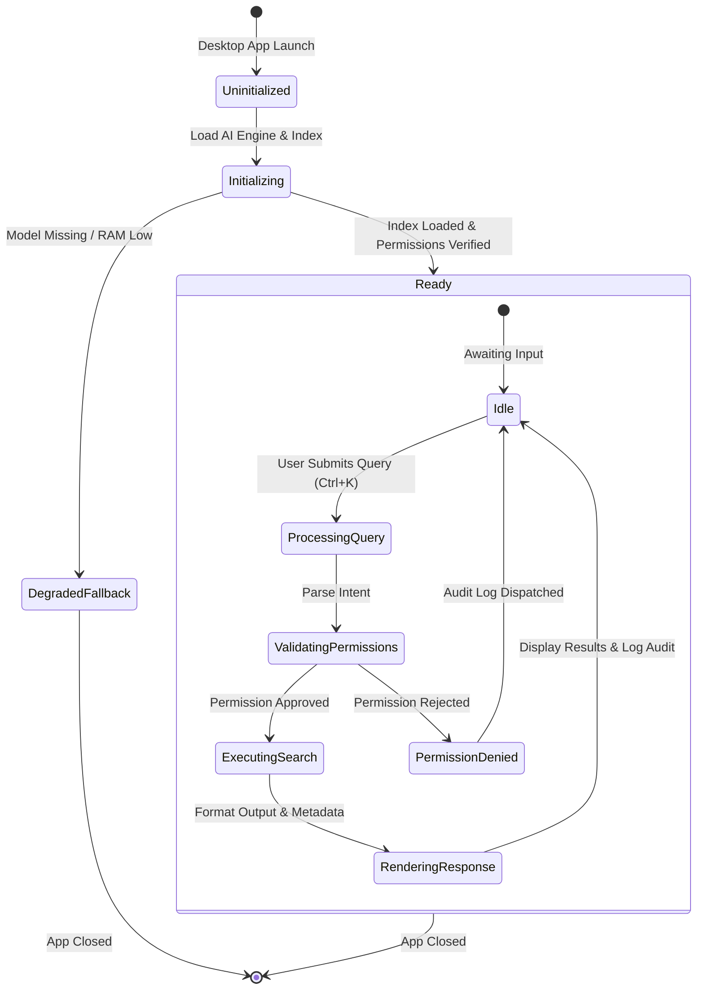

# Module-017 — Offline AI Medical Assistant User Flow Design

## Executive Summary

The **Offline AI Medical Assistant User Flow Specification** defines all interactive user journeys, intent detection processes, AI state machine lifecycles, permission enforcement gates, safety rejection boundaries, and exception handling catalogs for the Offline AI Medical Assistant Module (Module-017).

Every workflow is designed to maximize clinician productivity while strictly enforcing 100% offline local inference, zero data egress, read-only default scoping, and complete audit traceability.

---

## 1. Core User Workflows

### Flow 1: Open & Initialize Assistant Flow
```
User Presses Keyboard Shortcut (Ctrl+K / Cmd+K) / Clicks AI Assistant Button
        │
        ▼
Verify Local AI Runtime Status & Model Presence
        │
        ▼
Load Local Knowledge Index & SQLite FTS5 Vector Cache
        │
        ▼
Validate User Role & RBAC Permissions
        │
        ▼
Display AI Command Bar Overlay with Contextual Suggestions
        │
        ▼
Assistant Ready for Natural Language Input
```

---

### Flow 2: Natural Language Patient Search Flow
```
User Enters Input: "Open Ahmed Ali"
        │
        ▼
Local Intent Parser Detects Intent: SEARCH_PATIENT ("Ahmed Ali")
        │
        ▼
Query Local Patient Database (Name / Phone / National ID / MRN)
        │
        ▼
Validate User Permission to Access Patient Record
        │
        ├──────────────────────────┬──────────────────────────┐
        ▼                          ▼                          ▼
Single Match Found          Multiple Matches            No Match Found
        │                          │                          │
        ▼                          ▼                          ▼
Open Patient Profile       Display Disambiguation      Display Clear Notice:
Automatically              Pills Selection List       "Patient not found"
        │                          │                          │
        ▼                          ▼                          ▼
Log Audit Event            User Selects Patient       Log Audit Event
```

---

### Flow 3: Patient Clinical Summary Flow
```
User Requests: "Summarize this patient" / Clicks "Generate Summary" Button
        │
        ▼
Validate User RBAC Permissions (Doctor / Nurse)
        │
        ▼
Retrieve Authorized Patient Data (Diagnoses, Allergies, Meds, Encounters)
        │
        ▼
Local Summarization Engine Processes Data
        │
        ▼
Render Structured Summary Card:
  ├─ Chronic Diseases & Medical Flags
  ├─ Documented Allergies
  ├─ Active Medications & Dosages
  ├─ Recent Encounters (Last 3 Visits)
  └─ Recent Progress Notes & Vitals Trends
        │
        ▼
Append Integrity Metadata (Confidence Level, Data Sources, Timestamp)
        │
        ▼
Log Audit Event ("AI_SUMMARY_GENERATED")
```

---

### Flow 4: Chronological Visit History Flow
```
User Requests: "Show visit history"
        │
        ▼
Retrieve Encounters & Progress Notes Chronology
        │
        ▼
Analyze Timeline for Significant Events, Med Changes, & Recurring Symptoms
        │
        ▼
Render Chronological Interactive Timeline Display
        │
        ▼
Log Audit Event ("AI_TIMELINE_QUERIED")
```

---

### Flow 5: Prescription History Assistance Flow
```
User Requests: "Previous prescriptions" / "Show medication history"
        │
        ▼
Validate User Role (Doctor / Nurse)
        │
        ▼
Query Prescriptions Module Database
        │
        ▼
Group Prescriptions Chronologically with Active / Discontinued Badges
        │
        ▼
Suggest Reusable Prescription Bundles (Read-Only Suggestions)
        │
        ▼
Doctor Reviews Suggestions & Clicks "Apply to New Prescription" (If Desired)
```

---

### Flow 6: Medical Notes Assistance & Formatting Flow
```
Doctor Writes Rough Clinical Draft Notes
        │
        ▼
Clicks "Structure & Format Note" (SOAP Converter)
        │
        ▼
AI Reformats Text into Standardized SOAP Format & Expands Abbreviations
        │
        ▼
Render Side-by-Side Diff Preview (Draft vs. Formatted SOAP)
        │
        ▼
Doctor Reviews & Edits Formatted Text
        │
        ├─────────────────────────────────────┐
        ▼                                     ▼
Doctor Clicks "Approve & Save"         Doctor Clicks "Discard"
        │                                     │
        ▼                                     ▼
Notes Persisted to Medical Record      Original Draft Retained
(AI Never Auto-Saves)
```

---

### Flow 7: Attachment Metadata Search Flow
```
User Searches: "Blood Test Reports"
        │
        ▼
Query Attachment Metadata Store (Categories, Tags, File Names)
        │
        ▼
Validate Tenant & Patient Isolation Permissions
        │
        ▼
Display Filtered Attachment Roster Cards with Direct Preview Button
        │
        ▼
Log Audit Event ("AI_ATTACHMENTS_QUERIED")
```

---

### Flow 8: Reports & Financial Query Flow
```
User Asks: "Today's revenue summary" / "Patients currently waiting"
        │
        ▼
Detect Administrative Intent: QUERY_REPORTS
        │
        ▼
Validate Role (Clinic Manager / Doctor)
        │
        ▼
Query Existing Reports & Queue Modules (Zero Duplicate Business Logic)
        │
        ▼
Render Concise Metric Widget (Revenue / Queue Count)
```

---

### Flow 9: Intelligent Navigation Flow
```
User Types: "Open Appointments" / "Go to Billing"
        │
        ▼
Detect Navigation Intent: NAVIGATE_MODULE
        │
        ▼
Map to Route (`/appointments`, `/billing`, `/patients`)
        │
        ▼
Execute React Router Client Navigation
```

---

### Flow 10: Permission Failure & Security Block Flow
```
User Requests Unauthorized Action (e.g., Receptionist requesting revenue report)
        │
        ▼
Validate RBAC Role Permissions
        │
        ▼
Permission Check Fails
        │
        ▼
Display Secure Rejection Message: "Access Denied: Action exceeds your assigned role permissions."
        │
        ▼
Log Security Audit Event ("AI_ACCESS_DENIED")
```

---

### Flow 11: Local AI Initialization & Fallback Flow
```
Application Startup
        │
        ▼
Check Local AI Inference Engine Runtime Status
        │
        ├─────────────────────────────────────┐
        ▼                                     ▼
Engine Available                      Engine Missing / Failed
        │                                     │
        ▼                                     ▼
Load Local SQLite FTS5 Index          Display Graceful Fallback Banner:
        │                             "AI Assistant unavailable. Basic keyword
        ▼                              search active."
Assistant Ready & Online
```

---

## 2. Safety Workflows & Unsafe Request Rejections

> [!CAUTION]
> **Safety Rejection Protocol**:
> Whenever a user inputs a query requesting autonomous diagnosis, prescribing, or record modification, the assistant MUST execute the Safety Workflow:

```
User Inputs Unsafe Command (e.g., "Diagnose patient with chest pain" or "Prescribe Amoxicillin")
        │
        ▼
Safety Classifier Detects Violation (DIAGNOSIS_REQUEST / AUTONOMOUS_ACTION)
        │
        ▼
Reject Command Execution (No Data Changed)
        │
        ▼
Display Safety Explanation:
"Safety Limitation: The AI Assistant cannot diagnose diseases or prescribe medications. All clinical decisions must be made by the licensed physician."
        │
        ▼
Offer Safe Alternative:
"Would you like to view the patient's past cardiac records or previous prescriptions instead?"
```

---

## 3. AI Session Lifecycle State Machine



---

## 4. Exception Flow Catalog (EF-001 through EF-010)

| Error Code | Trigger Condition | System Behavior | User Guidance |
| --- | --- | --- | --- |
| **EF-001** | Model Not Installed | Detect missing local model binary on disk | Show banner: *"Local AI model file missing. Click to download local package."* |
| **EF-002** | Model Loading Failure | Memory allocation error or corrupted binary | Fallback to basic keyword search mode. |
| **EF-003** | Corrupted AI Index | SQLite FTS5 index read error | Rebuild local index automatically in background. |
| **EF-004** | Permission Denied | User role unauthorized for target data | Show access denied message; log audit event. |
| **EF-005** | Data Not Found | Query matches zero local records | Display: *"No matching records found in local database."* (Zero hallucinations) |
| **EF-006** | Local Storage Failure | Disk read error during search | Show: *"Storage read error. Check workstation disk space."* |
| **EF-007** | Low Workstation Memory | System RAM usage > 90% | Pause heavy summarization; switch to fast index lookup mode. |
| **EF-008** | AI Query Timeout | Query processing exceeds 5.0 seconds | Cancel query execution and return partial search results. |
| **EF-009** | Unsupported Query | Query intent cannot be mapped | Show suggested natural language commands list. |
| **EF-010** | Index Rebuilding Active | Indexing running after data import | Show progress spinner: *"Indexing local database (75%)."* |

---

## 2. Reserved Future Workflow Extensions (V2 Roadmap)

### Flow 12: Future Voice-to-Text Dictation Flow (Document Only)
`Microphone Capture` ➔ `Local Whisper Model` ➔ `Text Stream` ➔ `SOAP Formatting` ➔ `Doctor Approval`

### Flow 13: Future Local OCR Flow (Document Only)
`Scanned Document` ➔ `Local OCR Engine` ➔ `Extracted Text` ➔ `SQLite FTS5 Indexing` ➔ `Searchable`

### Flow 14: Future Local RAG Flow (Document Only)
`Complex Medical Query` ➔ `Local Vector Store` ➔ `Embedding Search` ➔ `Retrieved Context` ➔ `Local LLM Prompt`

---

## 6. Verification & Approval Gate

- [x] 11 Core User Workflows Documented
- [x] Safety Rejection Protocol Specified
- [x] State Machine Lifecycle Diagram Created
- [x] Exception Flow Catalog (EF-001 to EF-010) Defined
- [x] Future Reservations Documented
- [x] No Workflow Conflicts Found
